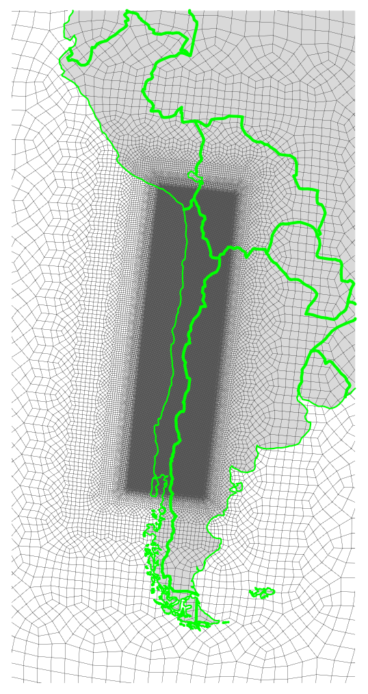

# EAMxx 3.25 km Chile RRM Technical Note

_Converted from `Chile_doc.tex` for LLNL Confluence-compatible Markdown._

## Contents

- [Introduction](#introduction)
- [Usage Note](#usage-note)
- [Resources](#resources)
- [Prepare E3SM codebase for standalone tools](#prepare-e3sm-codebase-for-standalone-tools)
- [RRM grid design](#rrm-grid-design)
  - [RRM exodus mesh](#rrm-exodus-mesh)
  - [mapping and domain files](#mapping-and-domain-files)
  - [topography](#topography)
  - [land surface data](#land-surface-data)
- [Initial conditions](#initial-conditions)
  - [atmosphere IC](#atmosphere-ic)
  - [land IC](#land-ic)
- [Model configurations (CIME xml)](#model-configurations-cime-xml)
  - [prepare E3SM codebase for simulations](#prepare-e3sm-codebase-for-simulations)
  - [add xml settings for grid](#add-xml-settings-for-grid)
  - [add xml setting for compset](#add-xml-setting-for-compset)
- [Boundary conditions](#boundary-conditions)
  - [create lower BL (SST, ice cover)](#create-lower-bl-sst-ice-cover)
  - [create lateral BL (nudging files)](#create-lateral-bl-nudging-files)
  - [output YAML](#output-yaml)
  - [user namelists and runscript](#user-namelists-and-runscript)
- [References](#references)

**Copyright statement:** The codes documented here are basically inherited/modified from previous practices in Resources listed in Table 1 or mentioned in the text, which is not subject to copyright restrictions.

## Introduction

The Chile Convection-Permitting (CP) Regionally Refined Model (RRM) used for Chile is developed based on the Simple Cloud-Resolving E3SM Atmosphere Model (SCREAM) version 1 (EAMxx code) under the United States (U.S) Department of Energy (DOE) Energy Exascale Earth System Model (E3SM) project [Caldwell2021] and the regionally refined model (RRM) configuration [Tang2019, Tang2023, Zhang2024, Bogenschutz2024].

SCREAM ChileRRM related code changes are located in <https://github.com/jsbamboo/E3SM/tree/jzhang/ChileRRMxx>. This document is available at <https://github.com/jsbamboo/gridprocessing/tree/ChileRRMxx/Chile>.

## Usage Note

This documentation does not represent best practices and should instead be regarded as a personal user log. Many steps have been simplified to varying degrees, depending on the user's specific research priorities.

The tools used in this record are not necessarily recommended or endorsed. Many steps can be accomplished using different tools depending on personal preference, availability, and the computational environment at the time. The scripts included here are not guaranteed to be out-of-box, especially for new users, e.g., differences in software versions and computing systems may easily lead to errors. Based on personal experience, most such issues can be resolved through self-debugging. Other users have also reported that AI coding tools can help translate between programming languages without significantly increasing workload.

For reference only.

## Resources

**Table: Main resources for references.**

| Category | Link |
| --- | --- |
| New grid homepage | <https://acme-climate.atlassian.net/wiki/spaces/DOC/pages/872579110/Running+E3SM+on+New+Grids> |
| RRM grid Library | <https://acme-climate.atlassian.net/wiki/spaces/DOC/pages/3690397775/Library+of+Regionally-Refined+Model+%28RRM%29+Grids> |
| Topography | <https://acme-climate.atlassian.net/wiki/spaces/DOC/pages/2720202817/Topography+Generation> |
| atm initial condition | <https://acme-climate.atlassian.net/wiki/spaces/DOC/pages/1002373272/Generate+atm+initial+condition+from+analysis+data> |
| streamfile | <https://esmci.github.io/cime/versions/ufs_release_v1.1/html/data_models/data-ocean.html> |
| Nudging | <https://acme-climate.atlassian.net/wiki/spaces/DOC/pages/20153276/How+to+perform+nudging+simulations+with+the+regional+refined+model+RRM> |
| SE grid visualization | <https://acme-climate.atlassian.net/wiki/spaces/DOC/pages/1210023949/Plotting+data+on+SE+native+grid> |
| TempestRemap algorithm | <https://acme-climate.atlassian.net/wiki/spaces/DOC/pages/178848194/Recommended+Mapping+Procedures+for+E3SM+Atmosphere+Grids> |
| ncremap | <https://acme-climate.atlassian.net/wiki/spaces/DOC/pages/754286611/Regridding+E3SM+Data+with+ncremap> |
| lnd initial condition | <https://github.com/zarzycki/betacast/tree/master/land-spinup> |
| CARRM v0 Technical Note | <https://acme-climate.atlassian.net/wiki/spaces/DOC/pages/3804299340/SCREAM+California+RRM+v0+Technical+Note> |

## Prepare E3SM codebase for standalone tools

```bash
git clone git@github.com:E3SM-Project/E3SM.git E3SM_tool_250318_notoprad
git checkout -b jzhang/tools/revert_toprad_250318
git revert afb3c3221f6c439cfbbe7c4e9725fa014fa44867 567fa1d665a2909266a3ee774e725e97b30a7f05
vi components/elm/bld/namelist_files/namelist_defaults_tools.xml
git add components/elm/bld/namelist_files/namelist_defaults_tools.xml
git rm components/elm/tools/mksurfdata_map/src/mktopradMod.F90
git revert --continue
vi components/elm/bld/namelist_files/namelist_defaults.xml
vi components/elm/bld/namelist_files/namelist_defaults_tools.xml
git add components/elm/bld/namelist_files/namelist_defaults.xml components/elm/bld/namelist_files/namelist_defaults_tools.xml
git rm components/elm/tools/mksurfdata_map/src/mktopradMod.F90
git revert --continue
git submodule update --init --recursive; git submodule sync --recursive; git submodule update --recursive
vi components/elm/bld/namelist_files/namelist_defaults_tools.xml # forget something ..
git add components/elm/bld/namelist_files/namelist_defaults_tools.xml
git commit --amend 
```

## RRM grid design

This section is largely inherited (and simplified) from the SCREAM CARRM v0 Technical Note: <https://acme-climate.atlassian.net/wiki/spaces/DOC/pages/3804299340/SCREAM+California+RRM+v0+Technical+Note>.

The main reference page (<https://acme-climate.atlassian.net/wiki/spaces/DOC/pages/872579110/Running+E3SM+on+New+Grids>) is a veritable repository of the entire process of generating RRM grids and the associated files needed to run RRM, down to the specific commands for each step and and installation commands of tools. Due to the rapid development of grid tools, many steps have multiple choices (based on different tools or different packages). For example, for mapping function, TempestRemap, mbtempset and ESMF_Regridweightgen are well encapsulated by ncremap; users can choose which tool commands to use by their preference.

**IMPORTANT NOTE:**

In this task, the authorss also tested a newer and more up-to-date repository (<https://github.com/whannah1/E3SM_grid_support>), which can fully replace the following steps under "RRM grid design" in this technical note:
- mapping and domain files
- topography

It is worth noting that these steps, particularly topography generation, have historically been among the most complicated components of the atmospheric-model RRM grid workflow. Therefore, we believe that the substantial simplification and modernization of both the algorithms and software implementation in this new tool are highly worthwhile to explore. In short, the workflow no longer depends on compiling several standalone Fortran tools (including *homme_tool* and *cube_to_target*). In addition, because the tool adopts much simpler algorithms together with the MPI-based mapping tool MBDA, the total runtime is significantly reduced. However, the default MBDA version currently relies on precompiled binaries maintained by the developer on several E3SM-supported machines (including Perlmutter used by the authors), so users only need to directly reference the provided binary executables.

Nevertheless, the original workflow is still required for other steps, including:
- land surface data
- atmosphere and land initial conditions
- model configurations (xml edits)
- creation of lower and lateral boundary conditions (SST, sea ice cover, nudging files)
- setting YAML files with *horizontal_remapper* for online remapped output streams
- setting user namelists and run scripts

Testing records for the new "E3SM_grid_support" tool are documented at:
<https://github.com/jsbamboo/E3SM_grid_support/tree/zhang73-perlm-Chile26-b0421>

### RRM exodus mesh

The Chile mesh "Chilene32x32v1" is generated by:
- using SQuadGen to get the RRM grid and tempestremap to get the pg2 grid and SCRIP files: `../scripts/grid_WL.00.SQuadGen_TR.01.gen_mesh_pg2_scrip.sh`
- using NCL to plot the native grid of Chile RRM: `../scripts/grid_WL.01.SQuadGen_NCL.02.plot_pg2_scrip.ncl`

`../scripts/grid_WL.00.SQuadGen_TR.01.gen_mesh_pg2_scrip.sh`

```bash
#!/bin/bash

RRMgrid=Chilene32x32v1

build_method="manual"
build_method="e3sm_unified"

if [ "${build_method}" = "manual" ];
# old: install it by yourself
SQuadGen_dir="/p/lustre2/zhang73/GitTmp/SourceCode"

cd ${SQuadGen_dir}/../
git clone git@github.com:ClimateGlobalChange/squadgen.git squadgen-v1.2.2; cd squadgen-v1.2.2
vi /p/lustre2/zhang73/GitTmp/E3SM_tool_250318_notoprad/cime_config/machines/config_machines.xml  # find NETCDF_FORTRAN_PATH for specific mach in E3SM
vi src/Makefile # copy NETCDF_FORTRAN_PATH
make all

SQuadGen_bin=${SQuadGen_dir}/SQuadGen

# for nco, ncl, tempest-remap
conda create --name all_stable26 -c conda-forge nco ncl ncview cdo imagemagick tempest-remap
conda activate all_stable26
fi 

if [ "${build_method}" = "e3sm_unified" ];
# new Chris G: We use SQuadGen which is available as part of E3SM Unified and refine over a rotated rectangular region using command line options:
source /usr/workspace/e3sm/apps/e3sm-unified/load_latest_e3sm_unified_dane.sh  # need e3sm group
module load gcc/13.3.1
module load mvapich2/2.3.7
module load ncl

SQuadGen_bin=SQuadGen
fi 

# if use e3sm_unified conda env 
${SQuadGen_bin} \
--output Chilene32x32v1.g \
--lat_ref -30.25 --lon_ref 289.5 \
--refine_rect "286,-17.5,293,-43,5" --refine_level 5 \
--x_rotate -6 \
--resolution 32 --smooth_type SPRING

GenerateVolumetricMesh --in Chilene32x32v1.g --out Chilene32x32v1pg2.g --np 2 --uniform
ConvertMeshToSCRIP --in Chilene32x32v1.g --out Chilene32x32v1_scrip.nc
ConvertMeshToSCRIP --in Chilene32x32v1pg2.g --out Chilene32x32v1pg2_scrip.nc

# rsync -av Chilene32x32v1.g $DIN_LOC_ROOT/atm/cam/inic/homme/
```

The mesh of Chile RRMs are shown in Fig. 1, plotted using NCL:

`../scripts/grid_WL.01.SQuadGen_NCL.02.plot_pg2_scrip.ncl`

```bash
ncl lat_width=60 lon_width=30 mpCenterLatF=-30.25 mpCenterLonF=289.5 'RRMgrid="Chilene32x32v1"' /p/lustre2/zhang73/GitTmp/SourceCode/gridprocessing/Chile/scripts/grid_WL.01.SQuadGen_NCL.02.plot_pg2_scrip.ncl

;======================================================================
; geo_4.ncl
;
; Concepts illustrated:
;   - Plotting data on a high-res geodesic mesh
;   - Setting the cell bounds for an unstructured mesh
;   - Using opacity to emphasize or subdue overlain features
;======================================================================
; This script requires NCL V6.6.0 or later to run, since it uses
; an updated version of gsn_coordinates.
;======================================================================

begin

mach="LC"
mach="perlm"

if(mach.eq."LC")then
    host_proc="/p/lustre2/zhang73"
else
    host_proc="/global/cfs/cdirs/e3sm/zhang73"
end if 

;!!!!!!!!!!!!!!!!!!!! User Need to Change !!!!!!!!!!!!!!!!!!!!!
  filepath      = (/host_proc+"/grids2/"+RRMgrid+"/"/)
  filename      = (/""+RRMgrid+"pg2_scrip.nc"/)
  path_plots = host_proc+"/plots/"
;!!!!!!!!!!!!!!!!!!!!!!!!!!!!!!!!!!!!!!!!!!!!!!!!!!!!!!!!!!!!!!!

  fig_out = path_plots+"area_pdf."+filename(0)
  print("----- making pg2_scrip plot: "+fig_out+".pdf ... ----- ")
  wks = gsn_open_wks("pdf",fig_out)

  draw_SP = False
  draw_mark = False

do ifile=0,dimsizes(filename)-1
  f = addfile(filepath(ifile)+filename(ifile),"r")

  r2d = get_r2d("float")
  cx = f->grid_corner_lon(::1,:) ;* r2d
  cy = f->grid_corner_lat(::1,:) ;* r2d

  dim=dimsizes(cx) ;/grid_size, grid_corners/

  ke=new(dim(0), float)
  ke=1
  ke(::2)=2
  ke(::3)=4
  ke@lon1d := f->grid_center_lon ;* r2d
  ke@lat1d := f->grid_center_lat ;* r2d
  grid_area := f->grid_area

  ;---Check if the grid size is as expected 
  re   = 6.37122e06
  grid_length_km := sqrt(grid_area)*re/1e3
  printMinMax(grid_length_km,0)
  print(num(grid_length_km.lt.5)+" of total: "+dimsizes(grid_area))
  ; plot=gsn_csm_xy(wks, area_pdf@bin_center, area_pdf, True)
  ; exit

  res                         = True
  res@gsnMaximize             = True
  res@gsnRightString          = ""
  res@gsnLeftString           = ""
  res@gsnCenterString         = "" 

  res@gsnDraw                 = False
  res@gsnFrame                = False

  res@mpProjection            = "Orthographic"     ; choose projection
  res@mpCenterLatF            = mpCenterLatF
  res@mpCenterLonF            = mpCenterLonF
  res@mpOutlineOn             = False
  res@mpPerimOn               = False
  res@mpFillOn                = True
  res@mpGridAndLimbOn         = False
  res@mpGridMaskMode          = "MaskLand"

  res@mpLandFillColor         = "tan"
  res@mpOceanFillColor        = "LightBlue"
  res@mpInlandWaterFillColor  = "Blue"

  ; res@tiMainString            = "Contours of data on high-res geodesic mesh (" +\
  ;                                dimsizes(ke) + " cells)"
  res@tiMainFontHeightF       = 0.02
  res@tiMainFont              = "helvetica"
  ; plot = gsn_csm_contour_map(wks,ke,res)

  ; res@tiMainString            =  filename(ifile) + " ("+ dimsizes(ke) + " cells)"
  res@tiMainString            =  "" ;"CA RRM grids (CA_ne32_x32)"
  ; plot = gsn_csm_contour_map(wks,ke,res)

  gsres                            = True
  gsres@gsnCoordsMeshLatBounds     = cy
  gsres@gsnCoordsMeshLonBounds     = cx
  gsres@gsnCoordsMeshClosePolygons = True      ; necessary to get fully closed polygons
  gsres@gsMarkerColor              = "Blue"   ; color to use for cell centers
  gsres@gsLineColor                = "gray30"   ; color to use for cell edges
  gsres@gsMarkerSizeF              = 1.0
  gsres@gsLineThicknessF           = 0.4;0.2

  res2=res
  projection_type="CylindricalEquidistant"
  res2@mpProjection=projection_type
  res2@mpProjection="Orthographic"
  plot = gsn_csm_map(wks, res2)
  ;---plot the first global mesh
  gsn_coordinates(wks,plot,(/ke/),gsres)

  ;---Zoom into the region of interest
  res@mpLimitMode                 = "LatLon"
  res@mpCenterLatF                = mpCenterLatF
  res@mpCenterLonF                = mpCenterLonF
  res@mpMinLatF                   = res@mpCenterLatF-lat_width/2.
  res@mpMaxLatF                   = res@mpCenterLatF+lat_width/2.
  res@mpMinLonF                   = res@mpCenterLonF-lon_width/2.
  res@mpMaxLonF                   = res@mpCenterLonF+lon_width/2.

  res@mpOutlineOn                 = True
  res@mpOutlineBoundarySets       = "USStates" ;"USStates"
  res@mpLandFillColor             = "gray85"
  res@mpOceanFillColor            = -1
  res@mpInlandWaterFillColor      = -1

  res@mpUSStateLineColor          = "green"
  res@mpUSStateLineThicknessF     = 3.
  res@mpNationalLineColor         = res@mpUSStateLineColor
  res@mpNationalLineThicknessF    = res@mpUSStateLineThicknessF * 2.0
  res@mpGeophysicalLineColor      = res@mpUSStateLineColor
  res@mpGeophysicalLineThicknessF = res@mpUSStateLineThicknessF
  res@mpCountyLineColor           = res@mpUSStateLineColor
  res@mpDataBaseVersion           = "Ncarg4_1"

  plot = gsn_csm_map(wks, res)
  ;---plot the second zoom in mesh
  gsn_coordinates(wks,plot,(/ke/),gsres)

  delete([/cx,cy,ke,res,res2,gsres/])
end do ;ifile

end
```



*Figure: Regionally refined mesh for Chile.*

### mapping and domain files

Chile model grid for atm, land, ocnice are all on Chilene32x32v1, while the river transport model is on a regular latitude-longitude grid with spacing of 0.125°. The mapping files are used for OCN2ATM ATM2ROF (flux, state/vector) and LND2ROF/ROF2LND (flux). All use FV-> FV aave (conservative, monotone, 1st order) algorithm.

Also need to create the mapping file for the Simple Prescribed Aerosol (SPA) scheme used in EAMxx. This is always from ne30np4 to the new grid pg2.

We highly suggest that readers refer to this web page for the knowledge of mapping procedures (notation, validation, issues, etc.) especially if readers plan to use bi-grid or tri-grid for RRM: <https://acme-climate.atlassian.net/wiki/spaces/DOC/pages/178848194/Recommended+Mapping+Procedures+for+E3SM+Atmosphere+Grids#RecommendedMappingProceduresforE3SMAtmosphereGrids-E3SMv2withpg2>).

Here the domain files are generated for "oRRS18to6v3" data-ocean (streamfile) and "Chilene32x32v1" atm & land.

`../scripts/grid_WL.02.gen_domain_map.sh`

```bash
#!/bin/bash

RRMgrid=Chilene32x32v1
ocn_grid_name=oRRS18to6v3
atm_grid_name=${RRMgrid}pg2
date_tag=$(date +"%Y%m%d")
lnd_grid_name=${atm_grid_name}

build_method="manual"
build_method="use_unified"

if [ "${build_method}" = "manual" ];then 
do_step="build"
fi 
do_step="remap"
do_step="gen_domain"
do_step="rsync_to_inputdata"

mach="LC"
mach="perlm"

if [ "${mach}" = "LC" ]; then
  mapping_root=/p/lustre2/zhang73/grids2/${RRMgrid}/
  source /usr/workspace/e3sm/apps/e3sm-unified/load_latest_e3sm_unified_dane.sh # need e3sm group
  # source ~/.bashrc_all_stable26
fi 
if [ "${mach}" = "perlm" ]; then
  mapping_root=/global/cfs/cdirs/e3sm/zhang73/grids2/${RRMgrid}/
  source /global/common/software/e3sm/anaconda_envs/load_e3sm_unified_1.10.0_pm-cpu.sh
fi 

# -----------------------------------------------------------------------------
if [ "${build_method}" = "manual" ];then 
e3sm_root=/p/lustre2/zhang73/GitTmp/E3SM_tool_250318_notoprad/
gen_domain_bin=${e3sm_root}/cime/tools/mapping/gen_domain_files/gen_domain

cd `dirname ${gen_domain}`/src
eval $(${e3sm_root}/cime/CIME/Tools/get_case_env)
${e3sm_root}/cime/CIME/scripts/configure --macros-format Makefile --mpilib mpi-serial # => get .env_mach_specific.sh
#--- addtional changes needed for dane: 
#       [Makefile] LDFLAGS += -L$(NETCDF_C_PATH)/lib -lnetcdf -L$(NETCDF_FORTRAN_PATH)/lib -lnetcdff
# .or.  [Makefile] LDFLAGS += $(shell nc-config --libs) $(shell nf-config --flibs)
# .and. [Makefile] LDFLAGS += -Wl,-rpath,$(NETCDF_C_PATH)/lib -Wl,-rpath,$(NETCDF_FORTRAN_PATH)/lib
# .or.  [.env_mach_specific.sh] export LD_LIBRARY_PATH=$HDF5_ROOT/lib:$NETCDF_C_PATH/lib:$NETCDF_FORTRAN_PATH/lib:$LD_LIBRARY_PATH
source .env_mach_specific.sh
gmake
exit 1

else #if [ "${build_method}" = "use_unified" ];then
gen_domain_bin=gen_domain # use e3sm_unified

fi 

# -----------------------------------------------------------------------------
if [ "${do_step}" = "remap" ];then 
# re-org by Chris G:
echo -e "\n----- Generate mapping file OCN2ATM -----"
# exit 1
ncremap -5 -a fv2fv_mono \
  -s $DIN_LOC_ROOT/ocn/mpas-o/oRRS18to6v3/ocean.oRRS18to6v3.scrip.181106.nc \
  -g ${mapping_root}/${atm_grid_name}.g \
  -m ${mapping_root}/map_${ocn_grid_name}_to_${atm_grid_name}.TRaave.${date_tag}.nc

echo -e "\n----- Generate mapping file LND2ROF -----"
ncremap -5 -a fv2fv_mono \
  -s ${mapping_root}/${atm_grid_name}.g \
  -g $DIN_LOC_ROOT/share/meshes/rof/MOSART_global_8th.scrip.20180211c.nc \
  -m ${mapping_root}/map_${atm_grid_name}_to_r0125.TRaave.${date_tag}.nc

echo -e "\n----- Generate mapping file ROF2LND -----"
ncremap -5 -a fv2fv_mono \
  -s $DIN_LOC_ROOT/share/meshes/rof/MOSART_global_8th.scrip.20180211c.nc \
  -g ${mapping_root}/${atm_grid_name}.g \
  -m ${mapping_root}/map_r0125_to_${atm_grid_name}.TRaave.${date_tag}.nc

echo -e "\n----- Generate mapping file for SPA (intbilin, SE -> FV) -----"
GenerateCSMesh --alt --res 30  --file ${mapping_root}/ne30.g
GenerateVolumetricMesh --in ne30.g --out ne30pg2.g --np 2 --uniform
ConvertMeshToSCRIP --in ne30pg2.g --out ne30pg2_scrip.nc

ncremap -5 -a intbilin_se2fv \
  -s ${mapping_root}/ne30.g \
  -g ${mapping_root}/${atm_grid_name}.g \
  -m ${mapping_root}/map_ne30np4_to_${atm_grid_name}.intbilin.${date_tag}.nc

ncks -O -5 ${mapping_root}/map_ne30np4_to_${atm_grid_name}.intbilin.${date_tag}.nc ${mapping_root}/map_ne30np4_to_${atm_grid_name}.intbilin.${date_tag}.nc
fi

# -----------------------------------------------------------------------------
if [ "${do_step}" = "gen_domain" ];then 
echo -e "\n----- Generate domain files -----"
cd ${mapping_root}

# if [ "${build_method}" = "manual" ];then 
#   source `dirname ${gen_domain}`/src/.env_mach_specific.sh
# fi 

#for target_grid_name in ${lnd_grid_name} ${atm_grid_name}; do #only need one as atm/lnd are the same
for target_grid_name in ${atm_grid_name}; do
    map_ocn_to_target=${mapping_root}/map_${ocn_grid_name}_to_${target_grid_name}.TRaave.${date_tag}.nc
    ${gen_domain_bin} -m ${map_ocn_to_target} -o ${ocn_grid_name} -l ${target_grid_name}
done
fi 

# -----------------------------------------------------------------------------
if [ "${do_step}" = "rsync_to_inputdata" ];then 
# echo -e "\n----- Copy mapping files to common input location -----"
# rsync -av ${mapping_root}/map*r0125*.${date_tag}.nc $DIN_LOC_ROOT/cpl/gridmaps/${atm_grid_name}/
# rsync -av ${mapping_root}/map_ne30np4_to_${atm_grid_name}.intbilin.${date_tag}.nc $DIN_LOC_ROOT/atm/scream/maps/

# echo -e "----- Copy domain files to common input location -----"
# rsync -av domain.lnd.${atm_grid_name}_${ocn_grid_name}.${date_tag:2}.nc $DIN_LOC_ROOT/share/domains/
# rsync -av domain.ocn.${atm_grid_name}_${ocn_grid_name}.${date_tag:2}.nc $DIN_LOC_ROOT/share/domains/
fi 
```

### topography

The topography file was generated using the NCAR topography toolchain [Lauritzen2015], with tensor hyperviscosity enabled for the RRM grid. V3 topography tool chain was used (<https://acme-climate.atlassian.net/wiki/spaces/DOC/pages/2712338924/V3+Topography+GLL+PG2+grids>).

`../scripts/grid_WL.03.topo_v3.sh`

```bash
#!/bin/bash

RRMgrid=Chilene32x32v1
mach="LC"
# mach="perlm"
if [ "${mach}" = "LC" ]; then 
e3sm_root=/p/lustre2/zhang73/GitTmp/E3SM_tool_250318_notoprad/
e3sm_root=/p/lustre2/zhang73/GitTmp/E3SM_tool_260410/ #try a new one, ESMF failed for np4 generated by this repo - reason unknow.. also note change tmp -> tmp1 (https://github.com/E3SM-Project/E3SM/commit/577844701399b2eee2d9f6dff3463dc04557a6f3)
c2b_bin="cube_to_target"
e3sm_root_env=/p/lustre2/zhang73/GitTmp/SCREAM_tool/
grids2=/p/lustre2/zhang73/grids2/
fi 
if [ "${mach}" = "perlm" ]; then 
e3sm_root=/pscratch/sd/z/zhang73/GitTmp/SCREAM_071923/
c2b_bin="cube_to_target_noexact"
e3sm_root=/global/cfs/cdirs/e3sm/zhang73/GitTmp/E3SM_tool_260410/
c2b_bin="cube_to_target"
grids2=/global/cfs/cdirs/e3sm/zhang73/grids2
fi 
machine=dane-intel
homme_tool_root=${e3sm_root}/components/homme/test/tool

do_step="step1.1_homme_tool_np4_build"
do_step="step1.2_homme_tool_np4_run"
do_step="step1.3_homme_tool_np4_ncl"
do_step="step2.1_cube_to_target_run1_build"
# do_step="step2.2_cube_to_target_run1_run"
# do_step="step3_homme_tool_smoothing"
# do_step="step4_cube_to_target_run2"
# do_step="step5_ncks_smoothedtopo"
do_step="step6_ncks_topo_np4" # optional, not required 

echo ${do_step} '...'
# -----------------------------------------------------------------------------

#!!!!!!!!!!!!!!!!!!!!!!!!!!!!!!!!!!!!!!!!!!!!!!!!!!!!!!!!!!
#--- Step 1: Create GLL and pg2 grid template files for !!!
#       the "USGS-topo-cube3000" high res data and the  !!!
#       target EAM grid.                                !!!
#!!!!!!!!!!!!!!!!!!!!!!!!!!!!!!!!!!!!!!!!!!!!!!!!!!!!!!!!!!
#--- Generate GLL SCRIP file for target grid: for RRM grids, this SCRIP files are good enough
#--- for topo downsampling, but not conservative enough for use in the coupled model:
# -----------------------------------------------------------------------------
if [ "${do_step}" == "step1.1_homme_tool_np4_build" ];then 
#--- 1.1 build homme_tool ---
# eval $(${e3sm_root}/cime/CIME/Tools/get_case_env)
rm -rf ${e3sm_root}/cmake_homme && mkdir ${e3sm_root}/cmake_homme && cd ${e3sm_root}/cmake_homme
source ${e3sm_root_env}/components/eam/tools/topo_tool/bin_to_cube/.env_mach_specific.sh
cmake \
    -C ${e3sm_root}/components/homme/cmake/machineFiles/dane-intel.cmake \
    -DBUILD_HOMME_WITHOUT_PIOLIBRARY=OFF \
    -DPREQX_PLEV=26 ${e3sm_root}/components/homme/
make -j4 homme_tool
exit 1
fi 

# -----------------------------------------------------------------------------
if [ "${do_step}" == "step1.2_homme_tool_np4_run" ];then 
#--- 1.2 run homme_tool ---
cd ${grids2}/${RRMgrid}/

rm -f input.nl
cat > input.nl <<EOF
&ctl_nl                                                                                                             
ne = 0                                                                                                       
mesh_file = "${grids2}/${RRMgrid}/${RRMgrid}.g"                                                   
/                                                                                                                    
&vert_nl                                                                                                            
/                                                                                                                   

&analysis_nl                                                                                                        
tool = 'grid_template_tool'                                                                                         
output_dir = "./"                                                                                                   
output_timeunits=1                                                                                                  
output_frequency=1                                                                                                  
output_varnames1='area','corners','cv_lat','cv_lon'                                                                 
!output_type='netcdf'                                                                                                
output_type='netcdf4p'  ! needed for ne1024                                                                        
io_stride = 16                                                                                                      
/                                                                                                                   
EOF

rm -f homme_tool_inputnl.sh
cat > homme_tool_inputnl.sh <<EOF
#!/bin/bash
#
#SBATCH --account=filexfer
#SBATCH --job-name=topo_gene
#SBATCH --nodes=1
##SBATCH -C cpu
#SBATCH --time=00:05:00
#SBATCH -p pbatch

source /p/lustre2/zhang73/GitTmp/SCREAM_tool/components/eam/tools/topo_tool/bin_to_cube/.env_mach_specific.sh
srun  -K -c 1 -N 1 /p/lustre2/zhang73/GitTmp/E3SM_tool_250318_notoprad/cmake_homme/src/tool/homme_tool < input.nl 
EOF
sbatch --exclusive homme_tool_inputnl.sh
exit 1
fi 

# -----------------------------------------------------------------------------
if [ "${do_step}" == "step1.3_homme_tool_np4_ncl" ];then 
#--- 1.3 NCL ---

cd ${grids2}/${RRMgrid}/

# build NCL: conda install -c conda-forge ncl
source ~/.bashrc_all_stable26
# ---make the 'scrip' file for target GLL grid       
ncks -O -v lat,lon,area,cv_lat,cv_lon ne0np4_tmp1.nc ${RRMgrid}np4_tmp.nc
ncl ${e3sm_root}/components/homme/test/tool/ncl/HOMME2SCRIP.ncl  name=\"${RRMgrid}np4\"  ne=0  np=4
exit 1 
fi 

#!!!!!!!!!!!!!!!!!!!!!!!!!!!!!!!!!!!!!!!!!!!!!!!!!!!!!!!!!!!!!!!!!!!!!!!
#--- Step 2: cube_to_target, run 1: Compute phi_s on the np4 grid.   !!!
#!!!!!!!!!!!!!!!!!!!!!!!!!!!!!!!!!!!!!!!!!!!!!!!!!!!!!!!!!!!!!!!!!!!!!!!
# -----------------------------------------------------------------------------
if [ "${do_step}" == "step2.1_cube_to_target_run1_build" ];then 
#--- build cube_to_target ---
export OS=Linux
cd ${e3sm_root}/components/eam/tools/topo_tool/cube_to_target
eval $(${e3sm_root}/cime/CIME/Tools/get_case_env)
${e3sm_root}/cime/CIME/scripts/configure
source .env_mach_specific.sh
echo "MPILIB: $MPILIB"
which nf-config
nf-config --flibs
which mpif90
exit 1
#--- changes added to ${e3sm_root}/components/eam/tools/topo_tool/cube_to_target/Makefile: 
#   LDFLAGS += $(USER_LDFLAGS)
# .and. LDFLAGS += -Wl,-rpath,$(NETCDF_C_PATH)/lib -Wl,-rpath,$(NETCDF_FORTRAN_PATH)/lib

if [[ "${mach}" = "LC" && "${e3sm_root}" == *"E3SM_tool_260410"* ]]; then
    #---try to build it again in a new codebase: E3SM_tool_260410
    # LIB_NETCDFF := $(shell nf-config --prefix)/lib
    # LIB_NETCDFC := $(shell nc-config --prefix)/lib
    # INC_NETCDF  := $(shell nf-config --prefix)/include
    # FFLAGS  += -I$(INC_NETCDF)
    # LDFLAGS += -L$(LIB_NETCDFC) -lnetcdf
    # LDFLAGS += -L$(LIB_NETCDFF) -lnetcdff
    # LDFLAGS += -Wl,-rpath,$(LIB_NETCDFC)
    # LDFLAGS += -Wl,-rpath,$(LIB_NETCDFF)
    # LDFLAGS += $(USER_LDFLAGS)
    # $(info LIB_NETCDFF=$(LIB_NETCDFF))
    # $(info LIB_NETCDFC=$(LIB_NETCDFC))
    # $(info INC_NETCDF=$(INC_NETCDF))
    # $(info FFLAGS=$(FFLAGS))
    # $(info LDFLAGS=$(LDFLAGS))
    INC_NETCDF="`nf-config --includedir`" \
        LIB_NETCDF="`nc-config --libdir`" USER_FC="`nc-config --fc`" \
        USER_LDFLAGS="`nc-config --libs` `nf-config --flibs`" make  
fi 

if [[ "${mach}" = "perlm" && "${e3sm_root}" == *"E3SM_tool_260410"* ]]; then
#---LIB_NETCDF, INC_NETCDF are correct, so dont need env now
# env LIB_NETCDF=/opt/cray/pe/netcdf-hdf5parallel/4.9.2.1/intel/2023.2/lib INC_NETCDF=/opt/cray/pe/netcdf-hdf5parallel/4.9.2.1/intel/2023.2/include FC=ifort make
#---Note that on Perlmutter you need to use `ftn` instead of `ifort` (which is not found). `ftn` is a frontend wrapper provided by the Cray Programming Environment. It automatically determines which underlying compiler to invoke, and adds the appropriate `-I` include paths, `-L` library paths, and links against MPI, NetCDF, HDF5, and other Cray system libraries.
FC=ftn make
fi 

exit 1 
fi 

# -----------------------------------------------------------------------------
if [ "${do_step}" == "step2.2_cube_to_target_run1_run" ];then 
${e3sm_root}/components/eam/tools/topo_tool/cube_to_target/cube_to_target \
--target-grid ${grids2}/${RRMgrid}/${RRMgrid}np4_scrip.nc \
--input-topography ${grids2}/USGS-topo-cube3000.nc \
--output-topography ${grids2}/${RRMgrid}/${RRMgrid}np4_gtopo30.nc
exit 1
fi

# -----------------------------------------------------------------------------
if [ "${do_step}" == "step3_homme_tool_smoothing" ];then 
#!!!!!!!!!!!!!!!!!!!!!!!!!!!!!!!!!!!!!!!!!!!!!!!!!!!!!!!!!!!!!!!!!!!!!
#--- Step 3: homme_tool:                                           !!!
#     Starting with the unsmoothed topo data on the GLL grid,     !!!
#     apply dycore specific smoothing. This uses the standard     !!!
#     tensor laplace smoothing algorithm with 6 iterations.       !!!
#     We use the naming convention "xNt", where N is the value    !!!
#     used for smooth_phis_numcycle and "t" denotes the use of    !!!
#     the tensor laplace.                                         !!!
#!!!!!!!!!!!!!!!!!!!!!!!!!!!!!!!!!!!!!!!!!!!!!!!!!!!!!!!!!!!!!!!!!!!!!
cd ${grids2}/${RRMgrid}/

rm -f input2.nl
cat > input2.nl <<EOF
&ctl_nl
ne = 0
mesh_file = '${grids2}/${RRMgrid}/${RRMgrid}.g'
smooth_phis_p2filt = 0
smooth_phis_numcycle = 6       ! increase for more smoothing
!smooth_phis_numcycle = 12        !for 16xdel2
!hypervis_order = 2           !for 16xdel2
smooth_phis_nudt = 4e-16
hypervis_scaling = 2
se_ftype = 2 ! actually output NPHYS; overloaded use of ftype
/
&vert_nl
/
&analysis_nl
tool = 'topo_pgn_to_smoothed'
infilenames = './${RRMgrid}np4_gtopo30.nc', './${RRMgrid}np4_smoothed_phis_x6t'
! output_type = 'netcdf'
io_stride = 16
/
EOF

rm -f homme_tool_inputnl2.sh
cat > homme_tool_inputnl2.sh <<EOF
#!/bin/bash
#
#SBATCH --account=filexfer
#SBATCH --job-name=topo_gene
#SBATCH --nodes=1
##SBATCH -C cpu
#SBATCH --time=00:05:00
#SBATCH -p pbatch

source /p/lustre2/zhang73/GitTmp/SCREAM_tool/components/eam/tools/topo_tool/bin_to_cube/.env_mach_specific.sh
srun  -K -c 1 -N 1 /p/lustre2/zhang73/GitTmp/E3SM_tool_250318_notoprad/cmake_homme/src/tool/homme_tool < input2.nl 
EOF
sbatch --exclusive homme_tool_inputnl2.sh
exit 1 
fi 

# -----------------------------------------------------------------------------
if [ "${do_step}" == "step4_cube_to_target_run2" ];then 
# #!!!!!!!!!!!!!!!!!!!!!!!!!!!!!!!!!!!!!!!!!!!!!!!!!!!!!!!!!!!!!!!!!!!!!!!!!!
# #--- Step 4: cube_to_target, run 2: Compute SGH, SGH30, LANDFRAC,       !!!
# #       and LANDM_COSLAT on the pg2 grid, using the pg2 phi_s data.     !!!
# #!!!!!!!!!!!!!!!!!!!!!!!!!!!!!!!!!!!!!!!!!!!!!!!!!!!!!!!!!!!!!!!!!!!!!!!!!!

#---!!! LC run-time err: already fix after 2025/05 broken by Lee, see grid_WL.all.commands.doc.*, but it failed again: NetCDF: Invalid dimension size
ls -l ${e3sm_root}/components/eam/tools/topo_tool/cube_to_target/${c2b_bin}
ls -l ${grids2}/${RRMgrid}/${RRMgrid}pg2_scrip.nc
ls -l ${grids2}/USGS-topo-cube3000.nc
ls -l ${grids2}/${RRMgrid}/${RRMgrid}np4_smoothed_phis_x6t1.nc
# exit 1
${e3sm_root}/components/eam/tools/topo_tool/cube_to_target/${c2b_bin} \
--target-grid ${grids2}/${RRMgrid}/${RRMgrid}pg2_scrip.nc \
--input-topography ${grids2}/USGS-topo-cube3000.nc \
--smoothed-topography ${grids2}/${RRMgrid}/${RRMgrid}np4_smoothed_phis_x6t1.nc \
--output-topography ${grids2}/${RRMgrid}/GTOPO30_${RRMgrid}np4pg2_x6t.nc
exit 1
fi 

# -----------------------------------------------------------------------------
if [ "${do_step}" == "step5_ncks_smoothedtopo" ];then 
# !!!!!!!!!!!!!!!!!!!!!!!!!!!!!!!!!!!!!!!!!!!!!!!!!!!!!!!!!!!!!!!!!!!!!!!!!!!
# --- Step 5: ncks: Append the GLL phi_s data to the output of step 4.   !!!
# !!!!!!!!!!!!!!!!!!!!!!!!!!!!!!!!!!!!!!!!!!!!!!!!!!!!!!!!!!!!!!!!!!!!!!!!!!!
cd ${grids2}/${RRMgrid}/
if [ "${mach}" = "LC" ]; then 
source /usr/workspace/e3sm/apps/e3sm-unified/load_latest_e3sm_unified_dane.sh
fi
if [ "${mach}" = "perlm" ]; then 
source /global/common/software/e3sm/anaconda_envs/load_e3sm_unified_1.10.0_pm-cpu.sh
fi 

ncks -A ${RRMgrid}np4_smoothed_phis_x6t1.nc GTOPO30_${RRMgrid}np4pg2_x6t.nc
exit 1
fi 

# -----------------------------------------------------------------------------
if [ "${do_step}" == "step6_ncks_topo_np4" ];then  
cd ${grids2}/${RRMgrid}/
if [ "${mach}" = "LC" ]; then 
source /usr/workspace/e3sm/apps/e3sm-unified/load_latest_e3sm_unified_dane.sh
fi
if [ "${mach}" = "perlm" ]; then 
source /global/common/software/e3sm/anaconda_envs/load_e3sm_unified_1.10.0_pm-cpu.sh
fi 

topo_pg2=GTOPO30_${RRMgrid}np4pg2_x6t.nc
topo_base_name=$(basename "$topo_pg2" .nc)
ncks -v lat,lon  ${RRMgrid}np4_gtopo30.nc  latlon_np4_ncol.nc
ncks -v PHIS_d  ${topo_base_name}.nc  ${topo_base_name}.PHIS_d.nc
ncrename -d ncol_d,ncol -v PHIS_d,PHIS  ${topo_base_name}.PHIS_d.nc  ${topo_base_name}.PHIS_d-rename.nc
ncks -A latlon_np4_ncol.nc  ${topo_base_name}.PHIS_d-rename.nc

exit 1
fi 
```

### land surface data

Two steps are needed to generate land surface data (`fsurdat`):
- preparation for the land surface data (`grid_WL.04.fsurdat_0102.mkmapdata_mksurfdata_pl_map.sh`)
- generate mapping files for each land surface input data file to input grid files (mkmapdata.sh)
- build `mksurfdata_map` tool
- generate namelist using `mksurfdata.pl`, and modify it (if needed)

- create the land surface data by `mksurfdata_map` (`grid_WL.fsurdat_02.mksurfdata_map_namelist.bash`)

Beside the land surface data, the land use file (`flanduse_timeseries`) is also needed for a grid-specified compset in multi-year simulations. The additional steps are:
- create a LUT (Land Use Translator) file list
- assign the `mksrf_fdynuse` to the LUT list in surfdata_map's namelist
- assign the `fdyndat` to the name of the land use file you want to create

`../scripts/grid_WL.04.fsurdat_0102.mkmapdata_mksurfdata_pl_map.sh`

```bash
#!/bin/sh

RRMgrid=Chilene32x32v1
#---use the up-to-date elm tool, and revert the toprad commits to avoid `the map_0.01x0.01 does not found error'
mach="LC"
# mach="perlm"
if [ "${mach}" = "LC" ]; then 
e3sm_root=/p/lustre2/zhang73/GitTmp/E3SM_tool_250318_notoprad
e3sm_root_build=/p/lustre2/zhang73/GitTmp/E3SM_tool_260410
grids2=/p/lustre2/zhang73/grids2/
fi
if [ "${mach}" = "perlm" ]; then 
# e3sm_root=/global/cfs/cdirs/e3sm/zhang73/GitTmp/E3SM_tool_250429_toprad
e3sm_root=/global/cfs/cdirs/e3sm/zhang73/GitTmp/E3SM_tool_250318_notoprad
e3sm_root_build=/global/cfs/cdirs/e3sm/zhang73/GitTmp/E3SM_tool_260410
grids2=/global/cfs/cdirs/e3sm/zhang73/grids2/
fi
GRIDFILE=${grids2}/${RRMgrid}/${RRMgrid}pg2_scrip.nc
INPUTDATA_ROOT=$DIN_LOC_ROOT
date_tag=$(date +"%Y%m%d")
year_fsurdat=2015
# rcp_tag=""
rcp_level=3-7.0
rcp_tag="-rcp ${rcp_level}"
cdate_manualcheck="260410" #LC
cdate_manualcheck="260411" #LC

do_step="step1_mkmapdata"
do_step="step2_gen_mksurfdata_pl"
# do_step="step3_build_mksurfdata_map"
do_step="step4_run_mksurfdata_map"

use_multiN=true #only needed for map_1km-merge-10min_HYDRO1K-merge-nomask

# -----------------------------------------------------------------------------
if [ "${do_step}" == "step1_mkmapdata" ];then
cd ${e3sm_root}/components/elm/tools/mkmapdata

echo '--- ESMFBIN_PATH start mkmapdata_sbatch.sh ---' 
#--- use esmf-mpi from unified env ---

if [ "${mach}" = "LC" ]; then 
export ESMFBIN_PATH=/usr/WS1/e3sm/apps/e3sm-unified/base/envs/e3sm_unified_1.10.0_login/bin
source ~/.bashrc_all_stable26
#--- Speed: WP10ne32x32v1 (WP20ne32x32v1) took 7.5min (<29min) for 1km-merge-10min_HYDRO1K-merge-nomask
export mpiexec="srun --account=focus --time=00:29:00 -p pbatch -N 20"  # waiting for a bank ... OOM on login node
fi  #LC

if [ "${mach}" = "perlm" ]; then 
#--- from grid_WL.fsurdat_0102.mkmapdata_mksurfdata_pl_map_demo_amazonx4v1.perlm.Dalei.sh
ESMF_version="e3sm_unified_1_11_1_pm-cpu_gnu_mpich"
export ESMFBIN_PATH=/global/common/software/e3sm/anaconda_envs/spack/e3sm_unified_1_11_1_pm-cpu_gnu_mpich/var/spack/environments/e3sm_unified_1_11_1_pm-cpu_gnu_mpich/.spack-env/view/bin
export mpiexec="srun -N 20 --time=00:29:00 --qos=regular -C cpu -A mp193"  # waiting for a bank ... OOM on login node
fi #perlm

echo $ESMFBIN_PATH
#--- env with ncl and nco

#--- dry-run to check the mapping file list
# ./mkmapdata.sh --gridfile ${GRIDFILE} --inputdata-path ${INPUTDATA_ROOT} --res ${RRMgrid}pg2 --gridtype global --esmf-path ${ESMFBIN_PATH} --output-filetype 64bit_offset --debug -v --list
# exit 1

#--- regridding 
if $use_multiN; then
./mkmapdata.sh --mpiexec "${mpiexec}" --gridfile ${GRIDFILE} --inputdata-path ${INPUTDATA_ROOT} --res ${RRMgrid}pg2 --gridtype global --esmf-path ${ESMFBIN_PATH}  --output-filetype 64bit_offset -v --batch
else 
./mkmapdata.sh --gridfile ${GRIDFILE} --inputdata-path ${INPUTDATA_ROOT} --res ${RRMgrid}pg2 --gridtype global --esmf-path ${ESMFBIN_PATH} --output-filetype 64bit_offset -v
fi 
echo " ./mkmapdata.sh --gridfile ${GRIDFILE} --inputdata-path ${INPUTDATA_ROOT} --res ${RRMgrid}pg2 --gridtype global --output-filetype 64bit_offset -v"
exit 1

fi #do_step: step1_mkmapdata

# -----------------------------------------------------------------------------
if  [ "${do_step}" == "step2_gen_mksurfdata_pl" ];then
cd ${e3sm_root}/components/elm/tools/mksurfdata_map

./mksurfdata.pl -res usrspec -usr_gname ${RRMgrid}pg2 -usr_gdate ${cdate_manualcheck} -y ${year_fsurdat} ${rcp_tag} -d -dinlc ${INPUTDATA_ROOT} -usr_mapdir ${e3sm_root}/components/elm/tools/mkmapdata

#---modify it manually if needed, e.g., add the landuse.timeseries <mksrf_fdynuse> <fdyndat>
cp namelist namelist_${RRMgrid}pg2_rcp${rcp_level}-${year_fsurdat}.${mach}
fi

# -----------------------------------------------------------------------------
if [ "${do_step}" == "step3_build_mksurfdata_map" ];then 
#---26/04/12: need to rebuild ./mksurfdata_map:
#       perlm: error while loading shared libraries: libnetcdff.so.6: cannot open shared object file: No such file or directory
#       LC: HDF5: infinite loop closing library
cd ${e3sm_root_build}/components/elm/tools/mksurfdata_map/src
rm -rf Depends* cmake_macros Macros.*

echo "eval $(${e3sm_root_build}/cime/CIME/Tools/get_case_env)"
echo "${e3sm_root_build}/cime/CIME/scripts/configure"
eval $(${e3sm_root_build}/cime/CIME/Tools/get_case_env)
# ${e3sm_root_build}/cime/CIME/scripts/configure --macros-format Makefile --mpilib mpi-serial #dont use seriel?
${e3sm_root_build}/cime/CIME/scripts/configure
source ${e3sm_root_build}/components/elm/tools/mksurfdata_map/src/.env_mach_specific.sh
echo "MPILIB: $MPILIB"
which nf-config
nf-config --flibs
which ftn #no ftn on LC
which mpif90
ftn --version
exit 1

cd ${e3sm_root}/components/elm/tools/mksurfdata_map/src #back to the code for notoprad
if [ "${mach}" = "LC" ]; then
    FC=ifx
    #---note env use new mach config, but code is old (notoprad)
    source /p/lustre2/zhang73/GitTmp/E3SM_tool_260410/components/elm/tools/mksurfdata_map/src/.env_mach_specific.sh
    INC_NETCDF="`nf-config --includedir`" \
        LIB_NETCDF="`nc-config --libdir`" USER_FC=ifx \
        USER_LDFLAGS="`nc-config --libs` `nf-config --flibs` -Wl,-rpath,${NETCDF_C_PATH}/lib -Wl,-rpath,${NETCDF_FORTRAN_PATH}/lib" make  
    mv mksurfdata_map  mksurfdata_map.LC_E3SM_tool_260410.ifx_240412
fi 

if [ "${mach}" = "perlm" ]; then 
    FC=ftn
    vi makefile.common -> for ftn: FFLAGS += -O2 -fp-model precise
    INC_NETCDF="`nf-config --includedir`" \
        LIB_NETCDF="`nc-config --libdir`" USER_FC=ftn \
        USER_LDFLAGS="`nc-config --libs` `nf-config --flibs` -Wl,-rpath,${NETCDF_C_PATH}/lib -Wl,-rpath,${NETCDF_FORTRAN_PATH}/lib" make  
    mv mksurfdata_map  mksurfdata_map.perlm_E3SM_tool_260410.ftn_noKieee
fi 

# exit 1
fi

# -----------------------------------------------------------------------------
if [ "${do_step}" == "step4_run_mksurfdata_map" ];then 
cd ${e3sm_root}/components/elm/tools/mksurfdata_map

#!!! bin is build with the notoprad code && new build env!!!
if [ "${mach}" = "LC" ]; then 
    mksurfdata_map_bin=${e3sm_root}/components/elm/tools/mksurfdata_map/mksurfdata_map.LC_E3SM_tool_260410.ifx_240412
fi 
if [ "${mach}" = "perlm" ]; then 
    mksurfdata_map_bin=${e3sm_root}/components/elm/tools/mksurfdata_map/mksurfdata_map.perlm_E3SM_tool_260410.ftn_noKieee
fi 
source ${e3sm_root_build}/components/elm/tools/mksurfdata_map/src/.env_mach_specific.sh

#---cannot use MPI actually due to  mpi-serial build? -> in the configure command, dont specify mpi-serial
# srun --account=mp193 --time=00:20:00 -q debug -N 1 -C cpu \
${mksurfdata_map_bin} < namelist_${RRMgrid}pg2_rcp${rcp_level}-${year_fsurdat}.${mach}

# mv surfdata_${RRMgrid}pg2_rcp8.5_simyr2015_${date_tag}.nc  landuse.timeseries_${RRMgrid}pg2_rcp8.5_simyr2015-2100_${date_tag}.nc  ${grids2}/${RRMgrid}/
# rsync -av ${grids2}/${RRMgrid}/surfdata_${RRMgrid}pg2_rcp8.5_simyr2015_${date_tag}.nc  landuse.timeseries_${RRMgrid}pg2_rcp8.5_simyr2015-2100_${date_tag}.nc  $DIN_LOC_ROOT/lnd/clm2/surfdata_map/
fi
```

## Initial conditions

### atmosphere IC

The atmosphere IC was generated with the HICCUP package (<https://github.com/E3SM-Project/HICCUP>), which has a built-in download of ERA5 pressure level data, a call to NCO's vertical interpolation algorithm (<https://nco.sourceforge.net/nco.html>), a call to TempestRemap horizontal interpolation algorithm (<https://github.com/ClimateGlobalChange/tempestremap>), and a procedure for adjusting surface temperature and pressure with topography following the ECMWF practice [Trenberth1993].

A good step-by-step tutorial can be found here: <https://acme-climate.atlassian.net/wiki/spaces/DOC/pages/1002373272/Generate+atm+initial+condition+from+analysis+data>. The readers are suggested to learn the HICCUP tool (<https://github.com/E3SM-Project/HICCUP>) and the relevant references for a better sense.

Optionally, one can manually generate the mapping files for np4 (IC) and pg2 (nudging) -> ERA5 0.25 deg and pass them to the HICCP run scripts (`hiccup_data.map_file`):

```bash
ncremap -a fv2se_stt -s /global/cfs/cdirs/e3sm/zhang73/DATA/data_hiccup/ERA5_721x1440_scrip.20220907.nc -g /global/cfs/cdirs/e3sm/zhang73/grids2/Chilene32x32v1/gridprocessing/Chilene32x32v1.g -m /global/cfs/cdirs/e3sm/zhang73/grids2/Chilene32x32v1/gridprocessing//map_ERA5_721x1440_to_Chilene32x32v1np4.TRhighorder.20260423.nc 
```

We did not need to spin up the atmosphere and to adjust the hyperviscosity additionally. The hyperviscosity timestep for dynamics were set to the default value inferred by the scaling factor from the coarse resolution to RRM.

HICCUP scripts for atm ICs:

```bash
python ../../submodules/HICCUP_fork/get_hindcast_data.ERA5.py --start-date=20250101 --output-root=/global/cfs/cdirs/e3sm/zhang73/DATA/data_hiccup/2025-01
python ../../submodules/HICCUP_fork/template_hiccup_scripts/create_EAMxx_IC_from_ERA5.2025-01-01_L128_Chilene32x32v1.py
```

### land IC

For the hindcast, we first use a land initial condition (IC) (e.g. v1 DECK), which is interpolated from a well-spun-up run, to create the initial conditions for the spinning-up of land-only simulations:
- `source_inic_file` (a land restart file from a balanced run to get the balanced land condition)
- `target_inic_file` (a land restart file from the new grid run to get the grid info)

`../scripts/grid_WL.IC.finidat.01.IELM_interpinic.E3SMv1toRRM.sh`

```bash
#!/bin/bash
# need to run a cold-start atm-land test to get the elm.r file

RRMgrid=Chilene32x32v1
e3sm_root=/p/lustre2/zhang73/GitTmp/E3SM_tool_250318_notoprad #---this netcdf version is not high enough to activate NF_FORMAT_64BIT_OFFSET

interpinic=${e3sm_root}/components/elm/tools/interpinic/
output_root=/p/lustre2/zhang73/grids2/finidat_interpinic
lnd_grid_name=${RRMgrid}pg2

do_step="step1_interpinic_build"
do_step="step2_interpinic_run"

# -----------------------------------------------------------------------------
if [ "${do_step}" == "step1_interpinic_build" ];then 
cd ${interpinic}/src
#---this netcdf version is not high enough to activate NF_FORMAT_64BIT_OFFSET
# eval $(${e3sm_root}/cime/CIME/Tools/get_case_env)
# ${e3sm_root}/cime/CIME/scripts/configure --macros-format Makefile --mpilib mpi-serial
# source .env_mach_specific.sh
source /p/lustre2/zhang73/GitTmp/SCREAM_tool/components/eam/tools/topo_tool/bin_to_cube/.env_mach_specific.sh

INC_NETCDF="`nf-config --includedir`" \
    LIB_NETCDF="`nc-config --libdir`" USER_FC="`nc-config --fc`" \
    USER_LDFLAGS="`nc-config --libs` `nf-config --flibs` -Wl,-rpath,${NETCDF_C_PATH}/lib -Wl,-rpath,${NETCDF_FORTRAN_PATH}/lib" make
exit 1
fi 

# -----------------------------------------------------------------------------
if [ "${do_step}" == "step2_interpinic_run" ];then 
  source_inic_file=/p/lustre2/zhang73/HPSS/20180215.DECKv1b_H1.ne30_oEC.edison/20180215.DECKv1b_H1.ne30_oEC.edison.clm2.r.2015-01-01-00000.nc
  output_inic_file=${output_root}/${lnd_grid_name}.elm.r.2015-01-01.nc
  if [ "${RRMgrid}" == "Chilene32x32v1" ];then 
  target_inic_file=/p/lustre1/zhang73/E3SM_simulations/ChileRRMxx/ChileRRMxx.Chilene32x32v1pg2_Chilene32x32v1pg2.F2010-SCREAMv1.dane/tests/1120x1_nhoursx1_ERA5pres-UVTQ6h-s20250101-O3/run/ChileRRMxx.Chilene32x32v1pg2_Chilene32x32v1pg2.F2010-SCREAMv1.dane.elm.r.2025-01-01-07200.nc
  fi 

  if ! test -f ${output_inic_file}; then cp ${target_inic_file} ${output_inic_file}; fi
  cd ${e3sm_root}/components/elm/tools/interpinic
  source /p/lustre2/zhang73/GitTmp/SCREAM_tool/components/eam/tools/topo_tool/bin_to_cube/.env_mach_specific.sh
  ./interpinic -i ${source_inic_file} -o ${output_inic_file}

  rsync -av ${output_inic_file} ${output_root}/../${RRMgrid}/gridprocessing/
fi
```

Then, we spinned up the land using 5-yr ERA5 under the *IELM-type* compset (i.e., *DATM*). The variables include 6-hourly 2-meter temperature, precipitation, 2-meter specific humidity, longwave radition (up) and shortwave radiation (down) at the surface. For the pseudo-global-warming (PGW) simulations, we used deltas from CESM LENS ensemble.

The main reference is the betacast package's land-spinup part: <https://github.com/zarzycki/betacast/tree/master/land-spinup>. Readers are also suggested to follow <https://acme-climate.atlassian.net/wiki/spaces/DOC/pages/872579110/Running+E3SM+on+New+Grids#8.-Generate-a-new-land-initial-condition-(finidat)> and <https://acme-climate.atlassian.net/wiki/spaces/DOC/pages/3107586055/Generating+land+model+initial+conditions>. A good reference for RRM land IC generation can be found at Weiran's documentation: <https://acme-climate.atlassian.net/wiki/spaces/NGDNA/pages/3556147426/CONUS+RRM+New+Grid+Generation+Process>.

Specifically:
- use `../scripts/grid_WL.IC.finidat.02.gen_datm.01.driver_getera5out.ERA5singlelev_NERSC.sh` to directly extract ERA5 near-surface variables (precipitation, downward shortwave radiation at the surface, downward longwave radiation at the surface, 2-m temperature and humidity, 10-m winds, surface pressure, etc.) from the maintained ERA5 path on NERSC, which are used to drive I-compsets. This version is used instead of the default downloading script in betacast because CDS downloads have recently become extremely slow. Note that the mean-flux variables changed from *an* (CDS) to *fc* (NERSC) (e.g., *ssrd* -> *msdwswrf*, *strd* -> *msdwlwrf*).

- use `../scripts/grid_WL.IC.finidat.02.gen_datm.02.betacast.gen-forcing.ERA5singlelev_NERSC.py` to reformat the ERA5 atmospheric forcing data into *DATM* format. This script is copied from `betacast/land-spinup/gen_datm/gen-forcing.py`, except for modifications to the radiative flux conversion because mean-flux variables are used instead.

- prepare `user_datm.streams.txt.*` (path & filename of stream files of DATM)

- add `user_nl_datm` in `runscript_IELM_core.sh`

- use `finidat_interpinic` tool to interpolate a spinned-up restart file from a historcial run to a temporary `finidat` on the RRM grid (same step as in the climotology simulation)

- add the interpolated `finidat` in `user_nl_elm` for the *IELM-type* run

- The additonal steps for PGW: get deltas from CESM LENS on perlmutter:</global/cfs/cdirs/m2637/betacast/deltas/CESMLENS_mlev/ens_T/Q/PRECC/PRECL_anom.nc>, and prepare `user_datm.streams.txt.Anomaly.*`

`../scripts/grid_WL.IC.finidat.02.gen_datm.01.driver_getera5out.ERA5singlelev_NERSC.sh`

```bash
#!/bin/bash

# Template script for IELM-DATM data generation from ERA5 pressure level data on perlmutter:
#     source directory: /global/cfs/projectdirs/m3522/cmip6/ERA5/. For the data stored 
#     there, each file has a main variable and several time steps.
echo -e " >>>   Template script for IELM-DATM generation (for betacast's gen-forcing.py) from ERA5 pressure level data on perlmutter. "
echo -e " >>>   This script will activate e3sm_unified env \n"

#######################################################
# USER NEED TO SPECIFY
timefreq=3 #the time frequency needed for IELM-DATM data

env_unified="/global/common/software/e3sm/anaconda_envs/load_e3sm_unified_1.10.0_pm-cpu.sh"
# source $env_unified

drc_out=/global/cfs/cdirs/e3sm/zhang73/datm7src_nersc/ERA5-DATM_3hourly/

# # year="2020"
echo "year: $1"
year=$1
# for year in `seq 2019 1 2025`;do
# for year in `seq 2003 1 2010`;do
# for year in `seq 2011 1 2018`;do
# for year in `seq 1940 1 2002`;do #1940 - 2018: dtn01, 2019-2025: dtn02
time_range="${year}0101-${year}1231"

# END USER DEFINED SETTINGS
########################################################

if ! test -d ${drc_out}/tmp/${year}/; then mkdir -p ${drc_out}/tmp/${year}/; fi
if ! test -d ${drc_out}/scripts/; then mkdir -p ${drc_out}/scripts/; fi
start_year=${time_range:0:4}; start_month=${time_range:4:2}; start_day=${time_range:6:2}
end_year=${time_range:9:4}; end_month=${time_range:13:2}; end_day=${time_range:15:2}
echo -e "Start Date: year=$start_year, month=$start_month, day=$start_day"
echo -e "End Date: year=$end_year, month=$end_month, day=$end_day \n"

# betacast var NERSC var in path  NERSC var in file  NERSC parent path        NERSC var long_name
# u10          128_165_10u        VAR_10U            e5.oper.an.sfc           "10 metre U wind component"
# v10          128_166_10v        VAR_10V            e5.oper.an.sfc           "10 metre V wind component"
# d2m          128_168_2d         VAR_2D             e5.oper.an.sfc           "2 metre dewpoint temperature"
# t2m          128_167_2t         VAR_2T             e5.oper.an.sfc           "2 metre temperature"
# sp           128_134_sp         SP                 e5.oper.an.sfc           "Surface pressure"
# mtpr         235_055_mtpr       MTPR               e5.oper.fc.sfc.meanflux  "Mean total precipitation rate"
# msdwswrf     235_035_msdwswrf   MSDWSWRF           e5.oper.fc.sfc.meanflux  "Mean surface downward short-wave radiation flux"
# msdwlwrf     235_036_msdwlwrf   MSDWLWRF           e5.oper.fc.sfc.meanflux  "Mean surface downward long-wave radiation flux"
var_file=(
 "128_165_10u"
 "128_166_10v"
 "128_168_2d"
 "128_167_2t"
 "128_134_sp"
 "235_055_mtpr"
 "235_035_msdwswrf"
 "235_036_msdwlwrf"
)
var_in=(
 "VAR_10U"
 "VAR_10V"
 "VAR_2D"
 "VAR_2T"
 "SP"
 "MTPR"
 "MSDWSWRF"
 "MSDWLWRF"
)
var_out=(
 "u10"      #0
 "v10"      #1
 "d2m"      #2
 "t2m"      #3
 "sp"       #4
 "mtpr"     #5
 "msdwswrf" #6
 "msdwlwrf" #7
)
stream=(
 "e5.oper.an.sfc"
 "e5.oper.an.sfc"
 "e5.oper.an.sfc"
 "e5.oper.an.sfc"
 "e5.oper.an.sfc"
 "e5.oper.fc.sfc.meanflux"
 "e5.oper.fc.sfc.meanflux"
 "e5.oper.fc.sfc.meanflux"
 )

nvar=${#var_file[@]}

#-------------------------------------------------------------------------------------------------------------
helper_py="${drc_out}/scripts/extract_meanflux_3hourly.py"

cat > "$helper_py" <<'PYEOF'
#!/usr/bin/env python
import argparse
import xarray as xr
import pandas as pd
import numpy as np

p = argparse.ArgumentParser()
p.add_argument("--files", nargs="+", required=True)
p.add_argument("--var-in", required=True)
p.add_argument("--var-out", required=True)
p.add_argument("--year", type=int, required=True)
p.add_argument("--month", type=int, required=True)
p.add_argument("--out", required=True)
p.add_argument("--timefreq", type=int, required=True)
args = p.parse_args()

ds = xr.open_mfdataset(args.files, combine="by_coords")

da = ds[args.var_in]

fit_name = "forecast_initial_time"
fh_name  = "forecast_hour"

fit = pd.to_datetime(ds[fit_name].values).to_numpy()
fh = np.asarray(ds[fh_name].values)
print("forecast_initial_time sample:", fit[:3])
print("forecast_hour sample:", fh[:])
print("forecast_hour dtype:", fh.dtype)

# broadcast
fh_td = pd.to_timedelta(fh, unit="h").to_numpy()
valid = fit[:, None] + fh_td[None, :]

da2 = da.stack(time=(fit_name, fh_name))
# remove MultiIndex-created coordinate variables before overwriting time
da2 = da2.drop_vars(["time", fit_name, fh_name], errors="ignore")
da2 = da2.assign_coords(time=("time", valid.reshape(-1)))
da2 = da2.sortby("time")

month_start = pd.Timestamp(args.year, args.month, 1)
next_month = month_start + pd.offsets.MonthBegin(1)

target_hours = list(range(0, 24, args.timefreq))

da2 = da2.where(
    (da2.time >= month_start)
    & (da2.time < next_month)
    & (da2.time.dt.hour.isin(target_hours)),
    drop=True,
)

times = pd.to_datetime(da2.time.values)
print("Selected valid_time:")
for t in times:
    print(t.strftime("%Y-%m-%d %H:%M:%S"))

expected = pd.date_range(
    start=month_start,
    end=next_month - pd.Timedelta(hours=args.timefreq),
    freq=f"{args.timefreq}h",
)
missing = expected.difference(times)
extra = pd.DatetimeIndex(times).difference(expected)

print(f"Selected ntime = {len(times)}")
print(f"Expected ntime = {len(expected)}")
if len(missing) > 0:
    print("Missing times:")
    for t in missing:
        print(t.strftime("%Y-%m-%d %H:%M:%S"))
if len(extra) > 0:
    print("Extra times:")
    for t in extra:
        print(t.strftime("%Y-%m-%d %H:%M:%S"))
if len(missing) > 0 or len(extra) > 0:
    raise RuntimeError("Selected valid_time does not match expected 6-hourly target times.")

out = da2.rename(args.var_out).to_dataset()
out = out.transpose("time", "latitude", "longitude")
# encoding = {
#     args.var_out: {"dtype": "float32"},
#     "latitude": {"dtype": "float32"},
#     "longitude": {"dtype": "float32"},
#     "time": {
#         "units": "hours since 1900-01-01 00:00:00",
#         "calendar": "standard",
#     },
# }
out.to_netcdf(args.out) #, encoding=encoding

PYEOF
chmod +x "$helper_py"

#-------------------------------------------------------------------------------------------------------------
for iy in `seq $start_year 1 $end_year`;do
iy_fmt=`printf %04d $iy`

if ! test -d ${drc_out}/${iy_fmt}/; then mkdir -p ${drc_out}/${iy_fmt}/; fi

for im in `seq 1 1 12`;do
im_fmt=`printf %02d $im`
# for id in `seq 1 1 31`;do
# id_fmt=`printf %02d $id`

# time_units='hours since '${iy_fmt}-${im_fmt}-01' 00:00:00'
# echo "time_units = $time_units"

#-------------------------------------------------------------------------------------------------------------
  echo "---- Start generating data on ${iy_fmt}${im_fmt} ----"

  for ((i=0; i<nvar; i++)); do # ori is monthly hourly 744 -> 124 (6-hourly)
  # for ((i=0; i<5; i++)); do # ori is monthly hourly 744 -> 124 (6-hourly)
  # for ((i=5; i<nvar; i++)); do #after 5: meanflux
  # for ((i=0; i<1; i++)); do # ori is monthly hourly 744 -> 124 (6-hourly)
    echo " >> loop for var: ${drc_out}/tmp/${year}/${var_out[$i]}.${iy_fmt}${im_fmt}.${timefreq}h.nc ... "
    drc_in=/global/cfs/projectdirs/m3522/cmip6/ERA5/${stream[$i]}/

    if [[ "${stream[$i]}" == *"e5.oper.an.sfc"* ]]; then

      ls -lhr ${drc_in}/${iy_fmt}${im_fmt}/${stream[$i]}.${var_file[$i]}.ll025sc.${iy_fmt}${im_fmt}*.nc
      ncks -O -d time,0,,${timefreq}  ${drc_in}/${iy_fmt}${im_fmt}/${stream[$i]}.${var_file[$i]}.ll025sc.${iy_fmt}${im_fmt}*.nc  ${drc_out}/tmp/${year}/${var_out[$i]}.${iy_fmt}${im_fmt}.${timefreq}h.nc

      if [[ "${var_in[$i]}" != "${var_out[$i]}" ]]; then
        ncrename -O -v  ${var_in[$i]},${var_out[$i]}  ${drc_out}/tmp/${year}/${var_out[$i]}.${iy_fmt}${im_fmt}.${timefreq}h.nc  ${drc_out}/tmp/${year}/${var_out[$i]}.${iy_fmt}${im_fmt}.${timefreq}h.nc
      fi
      # exit 1

    else #meanflux is complex, need to convert the forecast_initial_time + forecast_hour -> valid_time

      prev_ym=$(date -d "${iy_fmt}-${im_fmt}-01 -1 month" +%Y%m)
      prev_y=${prev_ym:0:4}
      prev_m=${prev_ym:4:2}

      files_meanflux=(
        "${drc_in}/${prev_y}${prev_m}/${stream[$i]}.${var_file[$i]}.ll025sc.${prev_y}${prev_m}16*.nc"
        "${drc_in}/${iy_fmt}${im_fmt}/${stream[$i]}.${var_file[$i]}.ll025sc.${iy_fmt}${im_fmt}01*.nc"
        "${drc_in}/${iy_fmt}${im_fmt}/${stream[$i]}.${var_file[$i]}.ll025sc.${iy_fmt}${im_fmt}16*.nc"
      )

      python "$helper_py" \
        --files ${files_meanflux[@]} \
        --var-in "${var_in[$i]}" \
        --var-out "${var_out[$i]}" \
        --year "$iy" \
        --month "$im" \
        --timefreq "$timefreq" \
        --out "${drc_out}/tmp/${year}/${var_out[$i]}.${iy_fmt}${im_fmt}.${timefreq}h.nc"
      # exit 1

    fi 

    echo "done. extract ${var_out[$i]}."
  done #var

  echo " >> combine all vars into one file: ${drc_out}/${iy_fmt}/out.${iy_fmt}.${im_fmt}.${timefreq}h.nc ..."
  # ---combine all vars into one file
  cp ${drc_out}/tmp/${year}/${var_out[0]}.${iy_fmt}${im_fmt}.${timefreq}h.nc  ${drc_out}/tmp/${year}/out.${iy_fmt}.${im_fmt}.${timefreq}h.nc 
  for ((i=1; i<nvar; i++)); do
  ncks -A -v ${var_out[$i]}  ${drc_out}/tmp/${year}/${var_out[$i]}.${iy_fmt}${im_fmt}.${timefreq}h.nc  ${drc_out}/tmp/${year}/out.${iy_fmt}.${im_fmt}.${timefreq}h.nc  
  # check the coord vars: /time, latitude, longitude/ = /120, 721, 1440/
  done 
  mv  ${drc_out}/tmp/${year}/out.${iy_fmt}.${im_fmt}.${timefreq}h.nc  ${drc_out}/${iy_fmt}/out.${iy_fmt}.${im_fmt}.${timefreq}h.nc 

  #---temporary fix
  # ncks -A -v  ${var_out[0]} ${drc_out}/tmp/${year}/${var_out[0]}.${iy_fmt}${im_fmt}.${timefreq}h.nc  ${drc_out}/${iy_fmt}/out.${iy_fmt}.${im_fmt}.${timefreq}h.nc
  # exit 1
  echo "done. combine all vars into one file."

  echo -e "---- ${drc_out}/tmp/${year}/out.${iy_fmt}.${im_fmt}.${timefreq}h.nc  was generated ----\n"
# exit 1
#-------------------------------------------------------------------------------------------------------------
# done #id
done #im
# exit 1
done #iy
rm ${drc_out}/tmp/${year}/*
done #year
```

`../scripts/grid_WL.IC.finidat.02.gen_datm.02.betacast.gen-forcing.ERA5singlelev_NERSC.py`
Almost identical to `betacast/land-spinup/gen_datm/gen-forcing.py`, so please refer directly to the betacast implementation, except that the following edits:

```bash
logger.info("fsds")
fsds_era5 = sliced_f.msdwswrf.values.astype(np.float32)
if do_flds:
    logger.info("flds")
    flds_era5 = sliced_f.msdwlwrf.values.astype(np.float32)

...

## Convert units 
#   * (zhang73) dont need this conversion as we're using meanflux now...
#   * to fit grid_WL.gen_datm.driver_getera5out.ERA5singlelev_NERSC.sh
#logger.info("Convert units")
#fsds_datm = fsds_datm / 3600.  # convert from J/s to W/m2 (over 1 hour)
#if do_flds:
#    flds_datm = flds_datm / 3600.
```

`runscript_IELM_core.sh`

```bash
cat <<EOF >> user_nl_elm
 check_finidat_year_consistency = .false.
 check_dynpft_consistency = .false.
 check_finidat_fsurdat_consistency = .false.
 check_finidat_pct_consistency = .false.
 !finidat = ' '
 finidat = '/p/lustre2/zhang73/grids2/finidat_interpinic/${RRMgrid}pg2.elm.r.2015-01-01.nc'
 flanduse_timeseries = '/p/vast1/e3sm/ccsm3data/inputdata/lnd/clm2/surfdata_map/landuse.timeseries_Chilene32x32v1pg2_rcp3.0_simyr2015-2100_c260502.LC.nc'
 fsurdat = '/p/vast1/e3sm/ccsm3data/inputdata/lnd/clm2/surfdata_map/surfdata_Chilene32x32v1pg2_rcp3.0_simyr2015_c260502.nc'

hist_avgflag_pertape='A','A'
hist_nhtfrq = 0,24
hist_mfilt = 1,30
hist_fincl1 = 'TSA','TBOT','RAIN','SNOW'
EOF

cat <<EOF >> user_nl_datm
!anomaly_forcing = 'Anomaly.Forcing.Precip','Anomaly.Forcing.Temperature','Anomaly.Forcing.Humidity','Anomaly.Forcing.Longwave'

tintalgo = "coszen", "nearest", "linear", "linear", "lower"

streams = "datm.streams.txt.CLMCRUNCEP.Solar 2019 2019 2025",
        "datm.streams.txt.CLMCRUNCEP.Precip 2019 2019 2025",
        "datm.streams.txt.CLMCRUNCEP.TPQW 2019 2019 2025",
        "datm.streams.txt.presaero.clim_2000 1 1 1", 
        "datm.streams.txt.topo.observed 1 1 1", 
EOF

cp /p/vast1/zhang73/datm7src_nersc/atm_forcing.datm7.${tfreq_datm}.ERA5.c260429/user_datm.streams.txt.LC.elmforc_nersc.Solar ${CASE_SCRIPTS_DIR}/user_datm.streams.txt.CLMCRUNCEP.Solar
cp /p/vast1/zhang73/datm7src_nersc/atm_forcing.datm7.${tfreq_datm}.ERA5.c260429/user_datm.streams.txt.LC.elmforc_nersc.TPQW ${CASE_SCRIPTS_DIR}/user_datm.streams.txt.CLMCRUNCEP.TPQW
cp /p/vast1/zhang73/datm7src_nersc/atm_forcing.datm7.${tfreq_datm}.ERA5.c260429/user_datm.streams.txt.LC.elmforc_nersc.Precip ${CASE_SCRIPTS_DIR}/user_datm.streams.txt.CLMCRUNCEP.Precip
cp /p/vast1/zhang73/datm7src_nersc/atm_forcing.datm7.${tfreq_datm}.ERA5.c260429/datm.streams.txt.LC.topo.observed ${CASE_SCRIPTS_DIR}/user_datm.streams.txt.topo.observed
#./preview_namelists
```

The runscript for a Beijing RRM IELM simulation can be found at:

`../scripts/runscripts/IELM.SI-3kmChileRRM-s20251001-interpini.ChileRRMxx.04262026.dane.1120.sh`

## Model configurations (CIME xml)

A series of CIME xml files need to be modified/created to support the new RRM grid and the specific compset required for the simulation. The first part is related to the *grid*. The second part is mainly related to the *compset* (partially subject to common requirements of grid and compset). The RRM related XML list can be found here: <https://acme-climate.atlassian.net/wiki/spaces/DOC/pages/872579110/Running+E3SM+on+New+Grids>.

The CIME xml files related to ChileRRM are listed as follows:
{
.1 grid.
.2 cime_config/config_grids.xml.
.2 components/eam/bld/config_files/horiz_grid.xml.
.2 driver-mct/cime_config/config_component_e3sm.xml.
.2 components/eamxx/cime_config/namelist_defaults_eamxx.xml.

.2 components/elm/bld/namelist_files/namelist_definition.xml.
.1 grid & compset.
.2 components/elm/bld/namelist_files/namelist_defaults.xml.
}

Note that for EAMxx: 1) dont need to add `ncdata` in `components/eam/bld/namelist_files/namelist_defaults_eam.xml`, 2) dont need to add landuse as the `2010_defscream_control` compset set the `sim_year_range` to be constant.

We directly use the `F2010-SCREAMv1` compset. So, only the grid-related XML changes are documented here.

### prepare E3SM codebase for simulations

```bash
git clone git@github.com:E3SM-Project/E3SM.git ChileRRMxx
# sync fork of E3SM master on Github website https://github.com/jsbamboo/E3SM/tree/master
cd ChileRRMxx
git remote add fork git@github.com:jsbamboo/E3SM.git
git checkout -b jzhang/ChileRRMxx
git submodule update --init --recursive; git submodule sync --recursive; git submodule update --recursive
# ...
# After modify all xml
git add .
git commit -m "set Chilene32x32v1 grids for eamxx"
git push fork jzhang/ChileRRMxx:jzhang/ChileRRMxx
```

### add xml settings for grid

- Specify the grid-related files in EAMxx's namelist:
- `Filename` (full pathname of initial atmospheric state dataset in NetCDF format)
- `spa_remap_file` (mapping file for SPA scheme)
- `topography_filename` (full pathname of time-invariant boundary dataset for topography fields)
- `mesh_file` (exodus format grid file used when `se_ne`=0, i.e., RRM grids)

- Set the parameters related to the stability of the model in EAMxx's namelist:
- `rad_frequency` (rad timestep, specified as number of atm steps)
- `number_of_subcycles` (how many times to subcycle this atm process)

- Set the parameters related to the stability of the model in both EAMxx's and eam's namelists:
- `nu_top` (second-order viscosity applied only near the model top [m2/s]), set to follow the the finest resolution grid
- `se_tstep` (dynamics timesteps)
- `dt_tracer_factor` (the tracer advection timestep is `dt_tracer_factor*se_tstep`, where `se_tstep` is the dynamics timesteps)
- `se_ne` set to zero for RRM

`cime_config/config_grids.xml`

```bash
    <model_grid alias="Chilene32x32v1pg2_Chilene32x32v1pg2">
      <grid name="atm">ne0np4_Chilene32x32v1.pg2</grid>
      <grid name="lnd">ne0np4_Chilene32x32v1.pg2</grid>
      <grid name="ocnice">ne0np4_Chilene32x32v1.pg2</grid>
      <grid name="rof">r0125</grid>
      <grid name="glc">null</grid>
      <grid name="wav">null</grid>
      <mask>oRRS18to6v3</mask>
    </model_grid>

    <domain name="ne0np4_Chilene32x32v1.pg2">
      <nx>134928</nx>
      <ny>1</ny>
      <file grid="atm|lnd" mask="oRRS18to6v3">$DIN_LOC_ROOT/share/domains/domain.lnd.Chilene32x32v1_oRRS18to6v3.20260413.nc</file>
      <file grid="ice|ocn" mask="oRRS18to6v3">$DIN_LOC_ROOT/share/domains/domain.ocn.Chilene32x32v1_oRRS18to6v3.20260413.nc</file>
      <desc>1-deg with 10 deg x 10 deg 3 km over Chile version 1 pg2:</desc>
    </domain>

    <gridmap atm_grid="ne0np4_Chilene32x32v1.pg2" rof_grid="r0125">
     <map name="ATM2ROF_FMAPNAME">cpl/gridmaps/Chilene32x32v1pg2/map_Chilene32x32v1pg2_to_r0125_traave.20260413.nc</map>
     <map name="ATM2ROF_SMAPNAME">cpl/gridmaps/Chilene32x32v1pg2/map_Chilene32x32v1pg2_to_r0125_traave.20260413.nc</map>
     <map name="LND2ROF_FMAPNAME">cpl/gridmaps/Chilene32x32v1pg2/map_Chilene32x32v1pg2_to_r0125_traave.20260413.nc</map>
     <map name="ROF2LND_FMAPNAME">cpl/gridmaps/Chilene32x32v1pg2/map_r0125_to_Chilene32x32v1pg2_traave.20260413.nc</map>
    </gridmap>
```

`components/eam/bld/config_files/horiz_grid.xml`

```bash
<horiz_grid dyn="se" hgrid="ne0np4_Chilene32x32v1"            ncol="303590" csne="0" csnp="4" npg="0" />
<horiz_grid dyn="se" hgrid="ne0np4_Chilene32x32v1.pg2"        ncol="134928" csne="0" csnp="4" npg="2" />
```

`components/eamxx/cime_config/namelist_defaults_eamxx.xml`

```bash
      <spa_remap_file hgrid="ne0np4_Chilene32x32v1">${DIN_LOC_ROOT}/atm/scream/maps/map_ne30np4_to_Chilene32x32v1pg2.intbilin.20260409.nc</spa_remap_file>
      <spc_remap_file hgrid="ne0np4_Chilene32x32v1">${DIN_LOC_ROOT}/atm/scream/maps/map_ne30np4_to_Chilene32x32v1pg2.intbilin.20260409.nc</spc_remap_file>
      <rad_frequency hgrid="ne0np4_Chilene32x32v1">3</rad_frequency>
      <number_of_subcycles hgrid="ne0np4_Chilene32x32v1">1</number_of_subcycles>
    <filename hgrid="ne0np4_Chilene32x32v1" nlev="128">${DIN_LOC_ROOT}/atm/scream/init/HICCUP.atm_era5.2025-01-01.highorder_Chilene32x32v1.L128.dataphis.nc</filename>
    <topography_filename hgrid="ne0np4_Chilene32x32v1">${DIN_LOC_ROOT}/atm/cam/topo/USGS-topo_Chilene32x32v1-np4_smoothedx6t_20260413.nopg2phis.nc</topography_filename>
    <nc hgrid="ne0np4_Chilene32x32v1">0.0</nc>
    <ni hgrid="ne0np4_Chilene32x32v1">0.0</ni>
    <nu_top hgrid="ne0np4_Chilene32x32v1">1.0e4</nu_top>
    <se_ne hgrid="ne0np4_Chilene32x32v1">0</se_ne>
    <se_tstep hgrid="ne0np4_Chilene32x32v1" constraints="gt 0">8.3333333333333</se_tstep>
    <mesh_file hgrid="ne0np4_Chilene32x32v1">${DIN_LOC_ROOT}/atm/cam/inic/homme/Chilene32x32v1.g</mesh_file>
```

`components/elm/bld/namelist_files/namelist_definition.xml`

```bash
<entry id="res" type="char*30" category="default_settings"
       group="default_settings"
       valid_values=
"...,ne0np4_Chilene32x32v1.pg2,...">
Horizontal resolutions
```

`components/elm/bld/namelist_files/namelist_defaults.xml`

```bash
<!-- Chilene32x32v1.pg2 -->
<fsurdat hgrid="ne0np4_Chilene32x32v1.pg2"   sim_year="2010" use_crop=".false." >
lnd/clm2/surfdata_map/surfdata_Chilene32x32v1pg2_rcp8.5_simyr2015_c260412.LC.nc</fsurdat>
```

`driver-mct/cime_config/config_component_e3sm.xml`

```bash
  <entry id="ATM_NCPL">
    <type>integer</type>
    <default_value>48</default_value>
    <values match="last">
      ...
      <value compset=".+" grid="a%ne0np4_Chilene32x32v1">864</value>
```

### add xml setting for compset

Simply use the default `F2010-SCREAMv1` compset.

## Boundary conditions

### create lower BL (SST, ice cover)

Sea surface temperature (SST) and ice cover were obtained from the same coupled simulation as lower boundary conditions to drive Data Ocean (*PRES_DOCN*) and Prescribed CICE (*SPBC_CICE*) as a streamfile.

The steps to download and process the NOAA SSTICE data:
- use HICCUP to download NOAA SST and sea ice
- use `poisson_grid_fill` function in NCL to fill missing values over land
- replace missing values of ice cover by 0, and add date & datesec variables in streamfile

Note that the second and third steps are essentially the same as the second step in the climatology simulation workflow. However, I’ve split them into two separate steps, as I generally use 1° SST and ice coverage for the DOCN and CICE simulations. Therefore, an additional regridding step from 0.25° to 1° is included in the third step. This is purely a user preference. The Poisson relaxation method is also widely used by other tools.

The corresponding scripts can be found at:

`../../submodules/HICCUP_fork/get_hindcast_data.NOAA_SSTICE.py`

`../scripts/grid_WL.sst_NOAA.0.fillmsg.ncl`

`../scripts/grid_WL.sst_NOAA.1.fmt-streamfile.ncl`

```bash
python /global/cfs/cdirs/e3sm/zhang73/GitTmp/SourceCode/HICCUP_fork/get_hindcast_data.NOAA_SSTICE.py --start-year=2025 --output-root=/global/cfs/cdirs/e3sm/zhang73/DATA/data_hiccup/
ncl 'year="2025"' /global/cfs/cdirs/e3sm/zhang73/GitTmp/SourceCode/gridprocessing/Chile/scripts/grid_WL.sst_NOAA.0.fillmsg.ncl
ncl 'year="2025"' 'cdate="c260422"' /global/cfs/cdirs/e3sm/zhang73/GitTmp/SourceCode/gridprocessing/Chile/scripts/grid_WL.sst_NOAA.1.fmt-streamfile.ncl
```

### create lateral BL (nudging files)

To constrain the lateral boundary conditions, the nudging capability has been plugged into the E3SM RRM framework. A global wind nudging is used with the nudging coefficient set by 1 over the whole globe and a consistent nudging strength in the vertical direction. A good step-by-step tutorial to use nudging for RRM can be found here: <https://acme-climate.atlassian.net/wiki/spaces/DOC/pages/20153276/How+to+perform+nudging+simulations+with+the+regional+refined+model+RRM>.

To enable the window (regional) nudging in EAMxx, we need to generate a nudging weights file offline and prescrib its full path in the runscript:

```bash
git clone git@github.com:E3SM-Project/eamxx-scripts.git
cd /global/cfs/cdirs/e3sm/zhang73/GitTmp/SourceCode/eamxx-scripts/run_scripts/RRM_example_scripts
cp SCREAMv1_create_nudging_weights.py SCREAMv1_create_nudging_weights_Chilene32x32v1pg2.py
vi SCREAMv1_create_nudging_weights_Chilene32x32v1pg2.py # Modify ``USER DEFINED SETTINGS''
python3  SCREAMv1_create_nudging_weights_Chilene32x32v1pg2.py  -datafile /global/cfs/cdirs/e3sm/zhang73/grids2/Chilene32x32v1/E3SM_grid_support/USGS-topo_Chilene32x32v1-np4_smoothedx6t_20260413.nopg2phis.nc -nlev 128 -lat lat -lon lon -weightsfile /global/cfs/cdirs/e3sm/zhang73/grids2/Chilene32x32v1/gridprocessing/Chilene32x32v1pg2_weighting_file.nc
```

Either HICCUP or a Bash script can be used to regrid the nudging files. Here, the Bash script version is used to directly access the maintained ERA5 pressure-level and surface datasets on NERSC because CDS downloads have recently become extremely slow.

The bash version for nudging:
- make horizontal mapping files from ERA5 72x1440 grid to the Chilene32x32v1pg2 grids
- use the bash script `../scripts/grid_WL.nudging.eamxx.driver.ERA5pres_NERSC.sh` to do the vertical and horizontal remapping using NCO

To make horizontal mapping files from ERA5 72x1440 grid to the Chilene32x32v1pg2 grids:

```bash
ncremap -a fv2fv_flx -s /global/cfs/cdirs/e3sm/zhang73/DATA/data_hiccup/ERA5_721x1440_scrip.20220907.nc -g /global/cfs/cdirs/e3sm/zhang73/grids2/Chilene32x32v1/gridprocessing/Chilene32x32v1pg2.g -m /global/cfs/cdirs/e3sm/zhang73/grids2/Chilene32x32v1/gridprocessing/map_ERA5_721x1440_to_Chilene32x32v1pg2.TRaave.20260423.nc
```

`../scripts/grid_WL.nudging.eamxx.driver.ERA5pres_NERSC.sh`

```bash
#!/bin/bash

# Template script for nudging data generation from ERA5 pressure level data on perlmutter:
#     source directory: /global/cfs/projectdirs/m3522/cmip6/ERA5/. For the data stored 
#     there, each file has a main variable and several time steps.
echo -e " >>>   Template script for nudging data generation from ERA5 pressure level data on perlmutter. "
echo -e " >>>   This script will activate e3sm_unified env \n"

#######################################################
# USER NEED TO SPECIFY
timefreq=3 #the time frequency needed for nudging data
# RRMgrid="WP10ne32x32v1"
RRMgrid="Chilene32x32v1"
TR_flag='TRaave'
nlev=128 # SCREAM RRM target number of vertical levels
drc_out=/global/cfs/cdirs/e3sm/zhang73/nudging.UVTQ/L${nlev}.${TR_flag}_${RRMgrid}pg2.UVTQ.0.25plev.v1/
if [ ${RRMgrid} == "WP10ne32x32v1" ];then 
mapfile=/global/cfs/cdirs/e3sm/zhang73/grids2/WP10ne32x32v1/map_ERA5_721x1440_to_WP10ne32x32v1pg2.TRaave.20251111.nc
fi 
if [ ${RRMgrid} == "WP20ne32x32v1" ];then 
mapfile=/global/cfs/cdirs/e3sm/zhang73/grids2/WP20ne32x32v1/map_ERA5_721x1440_to_WP20ne32x32v1pg2.TRaave.20251111.nc
fi
if [ ${RRMgrid} == "Chilene32x32v1" ];then 
mapfile=/global/cfs/cdirs/e3sm/zhang73/grids2/Chilene32x32v1/gridprocessing/map_ERA5_721x1440_to_Chilene32x32v1pg2.TRaave.20260423.nc
fi

ls ${mapfile}

env_unified="/global/common/software/e3sm/anaconda_envs/load_e3sm_unified_1.10.0_pm-cpu.sh"
source $env_unified

time_range='20240401-20241231'
time_range='20250101-20251231'
time_range='20260101-20260131' #need to prepare one day more!!!

# do_step="v1" #by default run both v0 and v1 steps (v0 is the predecessor of v1)

# END USER DEFINED SETTINGS
########################################################

start_date=${time_range%-*}
case_t0_start=$(date -d "${start_date}" +"%Y-%m-%d")"-00000"
echo ${case_t0_start}
# exit 1

if ! test -d ${drc_out}/tmp/; then mkdir -p ${drc_out}/tmp/; fi
if [ $nlev == 72 ];then 
  vert_coord=/global/cfs/cdirs/e3sm/inputdata/atm/scream/init/vertical_coordinates_L72_20220927.nc
else 
  vert_coord=/global/cfs/cdirs/e3sm/inputdata/atm/scream/init/vertical_coordinates_L128_20220927.nc
fi
start_year=${time_range:0:4}; start_month=${time_range:4:2}; start_day=${time_range:6:2}
end_year=${time_range:9:4}; end_month=${time_range:13:2}; end_day=${time_range:15:2}
echo -e "Start Date: year=$start_year, month=$start_month, day=$start_day"
echo -e "End Date: year=$end_year, month=$end_month, day=$end_day \n"

var_file=("128_131_u.ll025uv" "128_132_v.ll025uv" "128_130_t.ll025sc" "128_133_q.ll025sc" "128_134_sp.ll025sc")
var_in=("U" "V" "T" "Q" "SP")
var_out_v0=("U" "V" "T" "Q" "PS")
var_out_v1=("U" "V" "T_mid" "qv" "PS")
stream=(
 "e5.oper.an.pl"
 "e5.oper.an.pl" 
 "e5.oper.an.pl" 
 "e5.oper.an.pl" 
 "e5.oper.an.sfc" 
 )

nvar=${#var_file[@]}

#-------------------------------------------------------------------------------------------------------------
for iy in `seq $start_year 1 $end_year`;do
iy_fmt=`printf %04d $iy`
for im in `seq $start_month 1 $end_month`;do
im_fmt=`printf %02d $im`
for id in `seq 1 1 31`;do
id_fmt=`printf %02d $id`

time_tag=${iy_fmt}${im_fmt}${id_fmt}
case_t0="${iy_fmt}-${im_fmt}-${id_fmt}-00000"
time_units='hours since '${iy_fmt}-${im_fmt}-${id_fmt}' 00:00:00'

echo "case_t0 = $case_t0"
echo "time_units = $time_units"
echo "time_tag = $time_tag"

#-------------------------------------------------------------------------------------------------------------
# if [[ "${do_step}" = "v0" ]];then 
  echo "---- Start generating data on ${time_tag} (v0) ----"

  for ((i=0; i<nvar; i++)); do
    drc_in=/global/cfs/projectdirs/m3522/cmip6/ERA5/${stream[$i]}/
    if [ "${var_out_v0[$i]}" == "PS" ];then 
      cdo selday,${id}  ${drc_in}/${iy_fmt}${im_fmt}/${stream[$i]}.${var_file[$i]}.${iy_fmt}${im_fmt}*.nc  ${drc_out}/tmp/${var_out_v0[$i]}.${time_tag}.1h.nc
      ncks -O -d time,0,,${timefreq}  ${drc_out}/tmp/${var_out_v0[$i]}.${time_tag}.1h.nc  ${drc_out}/tmp/${var_out_v0[$i]}.${time_tag}.${timefreq}h.nc
      rm ${drc_out}/tmp/${var_out_v0[$i]}.${time_tag}.1h.nc
    else 
      ncks -O -d time,0,,${timefreq}  ${drc_in}/${iy_fmt}${im_fmt}/${stream[$i]}.${var_file[$i]}.${time_tag}*.nc  ${drc_out}/tmp/${var_out_v0[$i]}.${time_tag}.${timefreq}h.nc
    fi 
    if [[ "${var_in[$i]}" != "${var_out_v0[$i]}" ]]; then
      ncrename -O -v  ${var_in[$i]},${var_out_v0[$i]}  ${drc_out}/tmp/${var_out_v0[$i]}.${time_tag}.${timefreq}h.nc  ${drc_out}/tmp/${var_out_v0[$i]}.${time_tag}.${timefreq}h.nc
    fi

    echo "done. extract ${var_out_v0[$i]}."
  done #var

  #---combine all vars into one file
  cp ${drc_out}/tmp/${var_out_v0[0]}.${time_tag}.${timefreq}h.nc  ${drc_out}/tmp/era5p.${time_tag}.${timefreq}h.nc 
  for ((i=1; i<nvar; i++)); do
  ncks -A -v ${var_out_v0[$i]}  ${drc_out}/tmp/${var_out_v0[$i]}.${time_tag}.${timefreq}h.nc  ${drc_out}/tmp/era5p.${time_tag}.${timefreq}h.nc 
  done 
  echo "done. combine all vars into one file."

  ncremap -m ${mapfile} -i ${drc_out}/tmp/era5p.${time_tag}.${timefreq}h.nc -o ${drc_out}/tmp/era5p_${TR_flag}.${time_tag}.${timefreq}h.nc
  echo "done. horizontal interpolation to ${TR_flag}."

  #---change plev to Pa to let nco work correctly
  ncrename -O -d level,plev  ${drc_out}/tmp/era5p_${TR_flag}.${time_tag}.${timefreq}h.nc  ${drc_out}/tmp/era5p_${TR_flag}_plev.${time_tag}.${timefreq}h.nc
  ncap2 -O -s 'plev[$plev]=level*100'  ${drc_out}/tmp/era5p_${TR_flag}_plev.${time_tag}.${timefreq}h.nc  ${drc_out}/tmp/era5p_${TR_flag}_plev.${time_tag}.${timefreq}h.nc
  ncatted -O -a units,plev,o,c,'Pa' ${drc_out}/tmp/era5p_${TR_flag}_plev.${time_tag}.${timefreq}h.nc
  ncatted -a alternate_units,plev,d,,  ${drc_out}/tmp/era5p_${TR_flag}_plev.${time_tag}.${timefreq}h.nc
  ncks -O -x -v level ${drc_out}/tmp/era5p_${TR_flag}_plev.${time_tag}.${timefreq}h.nc  ${drc_out}/tmp/era5p_${TR_flag}_plev.${time_tag}.${timefreq}h.nc

  ncremap --vrt_fl=${vert_coord} -i  ${drc_out}/tmp/era5p_${TR_flag}_plev.${time_tag}.${timefreq}h.nc -o ${drc_out}/era5p_${TR_flag}_L${nlev}.${time_tag}.${timefreq}h.nc
  echo "done. vertical interpolation."

  echo -e "v0 ---- ${drc_out}/era5p_${TR_flag}_L${nlev}.${time_tag}.${timefreq}h.nc was generated ----\n"
# fi 
#-------------------------------------------------------------------------------------------------------------

# if [[ "${do_step}" = "v1" ]];then 
  echo "---- Continue generating data on ${time_tag} (v1) ----"

  out_fl="era5p_${TR_flag}_L${nlev}.${time_tag}.${timefreq}h"

  ncpdq -O -a ncol,lev  ${drc_out}/${out_fl}.nc  ${drc_out}/${out_fl}.ncpdq.nc

  for ((i=0; i<nvar; i++)); do
    if [[ "${var_out_v0[$i]}" != "${var_out_v1[$i]}" ]]; then
      ncrename -O -v  ${var_out_v0[$i]},${var_out_v1[$i]}  ${drc_out}/${out_fl}.ncpdq.nc  ${drc_out}/${out_fl}.ncpdq.nc
    fi
  done
  
  ncap2 -O -s 'PS=float(PS);' ${drc_out}/${out_fl}.ncpdq.nc ${drc_out}/${out_fl}.ncpdq.nc
  ncap2 -O -s 'p_mid[$time,$ncol,$lev]=0.0f;p_mid[$time,$ncol,$lev]=100000.0*hyam+PS*hybm' ${drc_out}/${out_fl}.ncpdq.nc  ${drc_out}/${out_fl}.ncpdq.nc
  ncatted -O -a units,p_mid,o,c,'Pa' ${drc_out}/${out_fl}.ncpdq.nc
  ncatted -O -a long_name,p_mid,o,c,'p_mid' ${drc_out}/${out_fl}.ncpdq.nc

  mv ${drc_out}/${out_fl}.ncpdq.nc  ${drc_out}/${out_fl}.ncpdq_FillValue.v1.nc
  ncatted -O -t -a _FillValue,,o,f,3.402824e+33  ${drc_out}/${out_fl}.ncpdq_FillValue.v1.nc

  ncap2 -O -s 'time=time-time(0);'  ${drc_out}/${out_fl}.ncpdq_FillValue.v1.nc  ${drc_out}/${out_fl}.ncpdq_FillValue.v1.nc
  ncatted -O -a units,time,o,c,'hours since '${iy_fmt}-${im_fmt}-${id_fmt}' 00:00:00' ${drc_out}/${out_fl}.ncpdq_FillValue.v1.nc
  ncatted -O -a case_t0,global,o,c,${case_t0} ${drc_out}/${out_fl}.ncpdq_FillValue.v1.nc
  ncks -O --mk_rec_dmn time ${drc_out}/${out_fl}.ncpdq_FillValue.v1.nc ${drc_out}/${out_fl}.ncpdq_FillValue.v1.nc
  
  ncks -O -5 ${drc_out}/${out_fl}.ncpdq_FillValue.v1.nc  ${drc_out}/${out_fl}.ncpdq_FillValue.v1.nc

  echo -e "v1 ---- ${drc_out}/${out_fl}.ncpdq_FillValue.v1.nc was generated ----\n"
# fi 
# exit 1
done #id
done #im
# exit 1
done #iy
rm -rf ${drc_out}/tmp/
```

### output YAML

Commands for generating mapping files to remap output to ne30 resolution:

```bash
ncremap -a fv2fv_flx  -s /global/cfs/cdirs/e3sm/zhang73/grids2/Chilene32x32v1/gridprocessing/Chilene32x32v1pg2_scrip.nc  -g /global/cfs/cdirs/e3sm/zhang73/grids/ne30pg2_scrip_20200209.nc  -m  /global/cfs/cdirs/e3sm/zhang73/grids2/Chilene32x32v1/gridprocessing/map_Chilene32x32v1pg2_to_ne30pg2_traave.20250426.nc
ncks -O -5 /global/cfs/cdirs/e3sm/zhang73/grids2/Chilene32x32v1/gridprocessing/map_Chilene32x32v1pg2_to_ne30pg2_traave.20250426.nc  /global/cfs/cdirs/e3sm/zhang73/grids2/Chilene32x32v1/gridprocessing/map_Chilene32x32v1pg2_to_ne30pg2_traave.20250426.nc
rsync -av /p/lustre2/zhang73/grids2/Chilene32x32v1/gridprocessing/map_Chilene32x32v1pg2_to_ne30pg2_traave.20250426.nc  ${DIN_LOC_ROOT}/atm/scream/maps/
```

Scripts for generating a Chile with buffer mapping file is conducted by the following steps:
- QGIS: download a Chile national boundary shapefile. In QGIS, apply *Dissolve* -> *Buffer* -> *Export* (EPSG:4326). In the buffer step, select "Dissolve result" with a 1-degree buffer.

- use `../scripts/grid_WL.YAML.eamxx.pg2icol_shp.00.gen_shpmask.ncl` to generate a mask file for the buffered Chile region.

- use `../scripts/grid_WL.YAML.eamxx.pg2icol_shp.01.gen_map.py` to generate mapping weights for the buffered Chile shapefile; the weight variable "S" is set to all ones.

- use `../scripts/grid_WL.YAML.eamxx.pg2icol_shp.02.check.ncl` to verify that the horizontal online remapping stream produces the expected results (i.e., correctly identifying the corresponding columns from the global pg2 output stream during post-processing).

`../scripts/grid_WL.YAML.eamxx.pg2icol_shp.00.gen_shpmask.ncl`

```bash
load "./grid_WL.shp_mask.00.shapefile_utils.ncl"

begin
mach="LC"
mach="perlm"
if(mach.eq."LC")then 
host_proc="/p/lustre2/zhang73"
end if
if(mach.eq."perlm")then 
host_proc="/global/cfs/cdirs/e3sm/zhang73"
end if

  grid="Chilene32x32v1"  
  if(str_get_cols(grid,0,2).eq."CAx")then 
    grid_real = str_get_cols(grid,0,1)+"ne32"+str_get_cols(grid,2,-1)
  else 
    grid_real = grid
  end if 
  print(grid_real)
  ; exit

  region="Chilebuffer"
  name_shp="shp_mask_"+grid+"pg2"

  if(grid.eq."Chilene32x32v1")then 
    scrip_name=""+host_proc+"/grids2/Chilene32x32v1/gridprocessing/Chilene32x32v1pg2_scrip.nc"
    a = addfile("/global/cfs/cdirs/e3sm/zhang73/backup/lc/lustre1/E3SM_simulations/ChileRRMxx/ChileRRMxx.Chilene32x32v1pg2_Chilene32x32v1pg2.F2010-SCREAMv1.dane/tests/1120x1_nhoursx1_ERA5pres-UVTQ6h-s20250101-O3/run/1hA.AVERAGE.nhours_x1.2025-01-01-03600.nc", "r")
  end if 

  if(region.eq."Chile_buffer")then 
    shp_filename = ""+host_proc+"/grids2/shapefile/chile_shp/cl_dissolved_buffered-1deg.shp"
  end if 
  
  f = addfile(scrip_name,"r")  
  r2d = get_r2d("float")
  x  = f->grid_center_lon ;* r2d
  y  = f->grid_center_lat ;* r2d
  cx = f->grid_corner_lon ;* r2d
  cy = f->grid_corner_lat ;* r2d
  print(cx(0:2,:)+", "+cy(0:2,:))
; exit
  dim=dimsizes(cx) ;/grid_size, grid_corners/
  ncol=dim(0)
  delete(dim)

diro = ""+host_proc+"/grids2/"+grid_real+"/"
if(region.eq."CA")then 
filo = region+"_shp_mask_"+grid+"pg2.nc"
else
filo = region+".shp_mask_landfrac."+grid+"pg2.nc"
end if

;================================================================================================
;---generate shp_mask
opt1             = True
opt1@return_mask = True
opt1@debug       = True
opt1@keep        = True

; make var's coordinates to fit shapefile
x_forshp=where(x.ge.180., x-360., x)
y_forshp=y

area = a->area
lat  = a->lat
lon  = a->lon
if(grid.eq."northamericax4v1")then
landfrac = a1->LANDFRAC(0,:)
else if(grid.eq."Chilene32x32v1")then 
landfrac = a->landfrac
else
landfrac = a->LANDFRAC(0,:)
end if
end if
if(grid.eq."Chilene32x32v1")then 
var_tmp = a->ps(0,:)
else 
var_tmp = a->PS(0,:)
end if 
var_tmp@lon1d = x_forshp
var_tmp@lat1d = y_forshp
shp_mask  = shapefile_mask_data(var_tmp, shp_filename, opt1)

;================================================================================================
;---save shp_mask to nc file
; setfileoption("nc", "Format",  "LargeFile")
; system("if ! test -d " + diro +" ; then mkdir -p " + diro + " ; fi")
system("/bin/rm -f " + diro + filo)
fout = addfile (diro + filo, "c")  

nl = integertochar(10)
globalAtt=True
globalAtt@history = nl+\
      systemfunc("date") + ": ncl < grid_WL.YAML.eamxx.pg2icol_shp.00.shp_mask.ncl "+nl + \
                            " scrip_name: "+scrip_name+" "+nl +\
                            " shp_filename: "+shp_filename
fileattdef(fout, globalAtt)

shp_mask!0="ncol"
fout->$name_shp$ = shp_mask
fout->area       = area
fout->lat        = lat 
fout->lon        = lon 
fout->landfrac   = landfrac

system("rsync -av "+diro + filo+" "+host_proc+"/grids2/shp_mask/")
;================================================================================================
;--use shp_mask to mask var
; var_mask = mask(var_tmp, shp_mask, 1)
end
```

`../scripts/grid_WL.YAML.eamxx.pg2icol_shp.01.gen_map.py`

```bash
import numpy as np
import os
import xarray as xr
import subprocess
from datetime import datetime

mach = 'LC'
mach = 'perlm'
if mach == 'LC':
    path_grid = '/p/lustre2/zhang73/grids2/'
if mach == 'perlm':
    path_grid = '/global/cfs/cdirs/e3sm/zhang73/grids2/'

#=======================================================================================================
def main():
    RRMgrid = 'Chilene32x32v1'
    shp_name = 'Chilebuffer'
    cdate = datetime.now().strftime("%Y%m%d")

    shp_file = f'{path_grid}shp_mask/{shp_name}.shp_mask_landfrac.{RRMgrid}pg2.nc'
    
    output_dir = f'{path_grid}/{RRMgrid}/gridprocessing/'
    os.makedirs(output_dir, exist_ok=True)
    mapping_output_file = os.path.join(
        output_dir,
        f'map_{RRMgrid}pg2_to_{shp_name}.pg2icol_shp.{cdate}.nc'
    )

    print(f"Find the shpmask pg2 icols with model file {shp_file} ...")
    save_shpmask_icol_mappings_to_netcdf(shp_file, mapping_output_file)

#=======================================================================================================
def save_shpmask_icol_mappings_to_netcdf(shp_file, mapping_output_file):
    ncol, shp_mask = load_shpmask_data(shp_file)

    # Select source grid columns inside the shapefile mask
    # Assuming shp_mask == 1 means inside the mask
    valid = shp_mask == 1
    icols_0based = np.where(valid)[0]

    if len(icols_0based) == 0:
        raise ValueError("No grid cells found with shp_mask == 1.")

    print(f"Total ncol = {ncol}")
    print(f"Selected masked columns = {len(icols_0based)}")

    save_mapping_netcdf(
        output_file=mapping_output_file,
        icols_0based=icols_0based,
        ncol=ncol
    )

#=======================================================================================================
def load_shpmask_data(shp_file):
    ds = xr.open_dataset(shp_file)

    ncol = ds.sizes["ncol"]

    # Find the shp_mask variable automatically
    mask_vars = [v for v in ds.data_vars if v.startswith("shp_mask")]
    if len(mask_vars) != 1:
        raise ValueError(f"Expected exactly one shp_mask variable, found: {mask_vars}")

    shp_mask = ds[mask_vars[0]].values

    ds.close()

    return ncol, shp_mask

#=======================================================================================================
def save_mapping_netcdf(output_file, icols_0based, ncol):
    """
    Mapping convention:
      col = source grid column, 1-based
      row = destination index, 1-based
      S   = mapping weight, here always 1

    Here each selected PG2 grid cell maps to one destination row.
    """

    n_s = len(icols_0based)

    # col is source global grid index, converted to 1-based
    col = icols_0based.astype(np.int32) + 1

    # row is destination grid index, also 1-based
    row = np.arange(1, n_s + 1, dtype=np.int32)

    S = np.ones(n_s, dtype=np.float32)

    ds_map = xr.Dataset(
        {
            "col": ("n_s", col),
            "row": ("n_s", row),
            "S": ("n_s", S),
            "icol_0based": ("n_s", icols_0based.astype(np.int32)),
        },
        coords={
            "n_s": np.arange(n_s, dtype=np.int32),
            "n_a": np.arange(ncol, dtype=np.int32),
            "n_b": np.arange(n_s, dtype=np.int32),
        },
        attrs={
            "description": "Mapping from global RRM PG2 grid columns to shapefile-mask destination columns",
            "convention": "col and row are 1-based; S is mapping weight",
            "source_ncol": int(ncol),
            "destination_ncol": int(n_s),
        }
    )

    ds_map["col"].attrs = {
        "long_name": "source grid column index",
        "index_base": "1-based",
    }
    ds_map["row"].attrs = {
        "long_name": "destination grid row index",
        "index_base": "1-based",
    }
    ds_map["S"].attrs = {
        "long_name": "mapping weights",
        "description": "All weights are 1 because this mapping directly extracts selected source columns",
    }
    ds_map["icol_0based"].attrs = {
        "long_name": "source grid column index in Python/xarray convention",
        "index_base": "0-based",
    }

    ds_map.to_netcdf(output_file)
    print(f"Mapping NetCDF saved to: {output_file}")

    output_file_cdf5 = output_file.replace(".nc", ".5.nc")
    convert_to_cdf5_ncks(output_file, output_file_cdf5)

#=======================================================================================================
def convert_to_cdf5_ncks(input_file, output_file):
    cmd = ["ncks", "-O", "-5", input_file, output_file]
    try:
        subprocess.check_call(cmd)
        print(f"Converted to CDF-5 using NCO: {output_file}")
    except subprocess.CalledProcessError as e:
        print(f"Failed to convert to CDF-5: {e}")

#=======================================================================================================
if __name__ == "__main__":
    main()
```

`grid_WL.YAML.eamxx.pg2icol_shp.02.check.ncl`

```bash
begin

dir = "/p/lustre1/zhang73/E3SM_simulations/ChileRRMxx/ChileRRMxx.Chilene32x32v1pg2_Chilene32x32v1pg2.F2010-SCREAMv1.dane/tests/1120x1_nhoursx1_ERA5pres-UVTQ6h-s20250101-O31/run/"
sim_pg2 = "1hA.AVERAGE.nhours_x1.2025-01-01-03600.nc"
sim_clbuffer = "1hA_clbuffer_check.AVERAGE.nhours_x1.2025-01-01-03600.nc"
file_shpmask = "/p/lustre2/zhang73/grids2/shp_mask/Chilebuffer.shp_mask_landfrac.Chilene32x32v1pg2.nc"

b = addfile(file_shpmask, "r")
shp_mask = b->shp_mask_Chilene32x32v1pg2

a = addfiles((/dir+sim_pg2,\
               dir+sim_clbuffer/), "r")
ps_pg2      = a[0]->ps(0,:) ;/time, ncol=134928/)
ps_clbuffer = a[1]->ps(0,:) ;/time, ncol=134928/)

ps_clbuffer_indmask = ps_pg2(ind(shp_mask.eq.1))
printVarSummary(ps_pg2)
printVarSummary(ps_clbuffer)
printVarSummary(ps_clbuffer_indmask)

printMinMax(ps_clbuffer - ps_clbuffer_indmask,0) ;0

end 
```

The settings of the output YAML files can be found in the `runtime_options() {` of `runscript_core.sh` in the next subsection.

### user namelists and runscript

The user namelists need to be modified to enable the lower/lateral BLs generated in the previous step. All the modifications are put in the `runscript_core.sh`.

- add prescribed SST and ice cover settings
- set `streams` for DOCN in `user_nl_docn`
- set `SSTICE_DATA_FILENAME`, `SSTICE_YEAR_ALIGN`, `SSTICE_YEAR_START`, `SSTICE_YEAR_END` by xmlchange
- set `stream_fldfilename` for `SPBC_CICE` in `user_nl_cice`

- add GHG forcing by atmchange
- add nudging settings by atmchange
- set YAML outputs by atmchange
- set RUN_STARTDATE, STOP_OPTION, RUN_TYPE, RESUBMIT etc. by xmlchange

`runscript_core.sh`

```bash
...
#-----------------------------------------------------
runtime_options() {

    echo $'\n----- Starting runtime_options -----\n'
    pushd ${CASE_SCRIPTS_DIR}

    # Set simulation start date
    if [ ! -z "${START_DATE}" ]; then
  ./xmlchange RUN_STARTDATE=${START_DATE}
    fi
    # Set temperature cut off in dycore threshold to 180K
    ./atmchange vtheta_thresh=180
    
    # Set nudging
    ./case.setup
    ./atmchange mac_aero_mic::atm_procs_list=tms,shoc,cld_fraction,spa,p3,nudging
    #./atmchange mac_aero_mic::atm_procs_list=tms,shoc,cld_fraction,spa,p3
    ./atmchange physics::atm_procs_list="mac_aero_mic,rrtmgp" #remove cosp
    #./atmchange physics::cosp::cosp_frequency_units="steps"
    #./atmchange physics::cosp::cosp_frequency=3 #3
    #./atmchange physics::cosp::cosp_subcolumns=1
    ./atmchange physics::rrtmgp::rad_frequency=3 #3 300s -> 5 min
    ./atmchange set_cld_frac_r_to_one=true

    ./case.setup 
    # make sure that ``time'' is set to unlimited o/w we'll receive SIGSEGV: "invalid memory reference without other clues"
    ./atmchange physics::mac_aero_mic::nudging::nudging_filenames_patterns=${NUDGING_ROOT}/era5p_TRaave_L128.2025????.3h.ncpdq_FillValue.v1.nc
    ./atmchange physics::mac_aero_mic::nudging::nudging_fields=U,V,T_mid,qv
    ./atmchange mac_aero_mic::nudging::source_pressure_type="TIME_DEPENDENT_3D_PROFILE"
    # we do can activate online horiz_remap + weighted nudging at the same time
    #   << if you want that, comment the EKAT MSG with ``coarse'' and ``weighted'' in eamxx_nudging_process_interface.cpp in the source code
    ./atmchange mac_aero_mic::nudging::nudging_refine_remap_mapfile="no-file-given"
    ./atmchange physics::mac_aero_mic::nudging::skip_vert_interpolation=true
    ./atmchange physics::mac_aero_mic::nudging::nudging_timescale=21600 #6h
    # need to generate a netcdf file of nudging_weights.  Please see the script
    #  SCREAMv1_create_nudging_weights.py to do this.
    ./atmchange physics::mac_aero_mic::nudging::use_nudging_weights=true
    ./atmchange physics::mac_aero_mic::nudging::nudging_weights_file=/p/lustre2/zhang73/grids2/${RRMgrid}/gridprocessing/${RRMgrid}pg2_weighting_file.nc
    # dont know why now we cannot ask for compute_tendencies for nudging. error: "The key 'nudging_T_mid_tend' is not associated to any registered product"
    #./atmchange physics::mac_aero_mic::nudging::compute_tendencies=T_mid,qv

    # Set atmos IC file
    # Allow for tendency outputs
    #./atmchange physics::mac_aero_mic::shoc::compute_tendencies=T_mid,qv
    #./atmchange physics::mac_aero_mic::p3::compute_tendencies=T_mid,qv
    #./atmchange physics::rrtmgp::compute_tendencies=T_mid
    #./atmchange homme::compute_tendencies=T_mid,qv

    #./atmchange physics::mac_aero_mic::p3::extra_p3_diags=true
    #./atmchange physics::mac_aero_mic::shoc::extra_shoc_diags=true

    ## use GHG levels more appropriate for 2019
    #./atmchange co2vmr=410.5e-6
    #./atmchange ch4vmr=1877.0e-9
    #./atmchange n2ovmr=332.0e-9
    #./atmchange orbital_year=2019
    ## use CO2 the same in land model
    #./xmlchange CCSM_CO2_PPMV=410.5

    # use GHG levels more appropriate for 2024 from NOAA GML websites
    ./atmchange co2vmr=424.6e-6
    ./atmchange ch4vmr=1929.5e-9
    ./atmchange n2ovmr=337.7e-9
    ./atmchange orbital_year=2024
    # use CO2 the same in land model
    ./xmlchange CCSM_CO2_PPMV=424.6

    #user_nl #if you set user_docn.streams instead, must activate it here
    ./xmlchange SSTICE_DATA_FILENAME="/p/lustre2/zhang73/DATA/data_hiccup/sst_ice.daymean.2020_2025_noleap.fillmsg.aave_1x1.fmt-c260502.nc"
    ./xmlchange SSTICE_YEAR_ALIGN="2020"
    ./xmlchange SSTICE_YEAR_START="2020"
    ./xmlchange SSTICE_YEAR_END="2025"
    
    # Segment length
    ./xmlchange STOP_OPTION=${STOP_OPTION,,},STOP_N=${STOP_N}

    # Restart frequency
    ./xmlchange REST_OPTION=${REST_OPTION,,},REST_N=${REST_N}

    # Coupler history
    ./xmlchange HIST_OPTION=${HIST_OPTION,,},HIST_N=${HIST_N}

    # Coupler budgets (always on)
    ./xmlchange BUDGETS=TRUE

    # Set resubmissions
    if (( RESUBMIT > 0 )); then
  ./xmlchange RESUBMIT=${RESUBMIT}
    fi

    # Run type
    # Start from default of user-specified initial conditions
    if [ "${MODEL_START_TYPE,,}" == "initial" ]; then
  ./xmlchange RUN_TYPE="startup"
  ./xmlchange CONTINUE_RUN="FALSE"

    # Continue existing run
    elif [ "${MODEL_START_TYPE,,}" == "continue" ]; then
  ./xmlchange CONTINUE_RUN="TRUE"

    elif [ "${MODEL_START_TYPE,,}" == "branch" ] || [ "${MODEL_START_TYPE,,}" == "hybrid" ]; then
  ./xmlchange RUN_TYPE=${MODEL_START_TYPE,,}
  ./xmlchange GET_REFCASE=${GET_REFCASE}
  ./xmlchange RUN_REFDIR=${RUN_REFDIR}
  ./xmlchange RUN_REFCASE=${RUN_REFCASE}
  ./xmlchange RUN_REFDATE=${RUN_REFDATE}
  echo 'Warning: $MODEL_START_TYPE = '${MODEL_START_TYPE}
  echo '$RUN_REFDIR = '${RUN_REFDIR}
  echo '$RUN_REFCASE = '${RUN_REFCASE}
  echo '$RUN_REFDATE = '${START_DATE}

    else
  echo 'ERROR: $MODEL_START_TYPE = '${MODEL_START_TYPE}' is unrecognized. Exiting.'
  exit 380
    fi

cat <<EOF >> 1mA.yaml
%YAML 1.1
---
averaging_type: average
max_snapshots_per_file: 12
filename_prefix: 1mA
fields:
  physics_pg2:
    field_names:
    - landfrac
    - ocnfrac
iotype: pnetcdf
output_control:
  frequency: 1
  frequency_units: nmonths
restart:
  force_new_file: true
EOF

cat <<EOF >> 6hI_ne30pg2.yaml
%YAML 1.1
---
averaging_type: instant
max_snapshots_per_file: 1460
filename_prefix: 6hI_ne30pg2
horiz_remap_file: \${DIN_LOC_ROOT}/atm/scream/maps/map_Chilene32x32v1pg2_to_ne30pg2_traave.20250426.nc
fields:
  physics_pg2:
    field_names:
    - ps
    - SeaLevelPressure
    - T_2m
    - RelativeHumidity_at_2m_above_surface
    - qv_2m
    - VapWaterPath
    - ZonalVapFlux
    - MeridionalVapFlux
    - z_mid_at_500hPa
    - T_mid_at_200hPa
    - T_mid_at_500hPa
    - U_at_850hPa
    - V_at_850hPa
iotype: pnetcdf
output_control:
  frequency: 6
  frequency_units: nhours
restart:
  force_new_file: true
EOF

cat <<EOF >> 1hA.yaml
%YAML 1.1
---
averaging_type: average
max_snapshots_per_file: 8760
filename_prefix: 1hA
fields:
  physics_pg2:
    field_names:
    - RelativeHumidity_at_2m_above_surface
    - qv_at_model_bot
    - qv_2m
    - T_2m
    - T_mid_at_model_bot
    - surf_radiative_T
    - ps
    - U_at_10m_above_surface
    - V_at_10m_above_surface
    - wind_speed_10m
    - U_at_90m_above_surface
    - V_at_90m_above_surface
    - SW_flux_dn_at_model_bot
    - sfc_flux_dir_nir
    - sfc_flux_dir_vis
    - sfc_flux_dif_nir
    - sfc_flux_dif_vis
    - LW_flux_up_at_model_top
    - precip_total_surf_mass_flux
    - snow_depth_land
iotype: pnetcdf
output_control:
  frequency: 1
  frequency_units: nhours
restart:
  force_new_file: true
EOF

cat <<EOF >> 15minA_clbuffer.yaml
%YAML 1.1
---
averaging_type: average
max_snapshots_per_file: 35040 # 1 yr x 24 h x 4 
filename_prefix: 15minA_clbuffer
horiz_remap_file: \${DIN_LOC_ROOT}/atm/scream/maps/map_Chilene32x32v1pg2_to_Chilebuffer.pg2icol_shp.20260501.5.nc
fields:
  physics_pg2:
    field_names:
    - RelativeHumidity_at_2m_above_surface
    - qv_at_model_bot
    - qv_2m
    - T_2m
    - T_mid_at_model_bot
    - surf_radiative_T
    - ps
    - U_at_10m_above_surface
    - V_at_10m_above_surface
    - wind_speed_10m
    - U_at_90m_above_surface
    - V_at_90m_above_surface
    - SW_flux_dn_at_model_bot
    - sfc_flux_dir_nir
    - sfc_flux_dir_vis
    - sfc_flux_dif_nir
    - sfc_flux_dif_vis
    - LW_flux_up_at_model_top
    - precip_total_surf_mass_flux
    - snow_depth_land
iotype: pnetcdf
output_control:
  frequency: 15
  frequency_units: nmins
restart:
  force_new_file: true
EOF

#---only for checking in test runs---
cat <<EOF >> 1hA_clbuffer_check.yaml
%YAML 1.1
---
averaging_type: average
max_snapshots_per_file: 8760
filename_prefix: 1hA_clbuffer_check
horiz_remap_file: \${DIN_LOC_ROOT}/atm/scream/maps/map_Chilene32x32v1pg2_to_Chilebuffer.pg2icol_shp.20260501.5.nc
fields:
  physics_pg2:
    field_names:
    - RelativeHumidity_at_2m_above_surface
    - qv_at_model_bot
    - qv_2m
    - T_2m
    - T_mid_at_model_bot
    - surf_radiative_T
    - ps
    - U_at_10m_above_surface
    - V_at_10m_above_surface
    - wind_speed_10m
    - U_at_90m_above_surface
    - V_at_90m_above_surface
    - SW_flux_dn_at_model_bot
    - sfc_flux_dir_nir
    - sfc_flux_dir_vis
    - sfc_flux_dif_nir
    - sfc_flux_dif_vis
    - LW_flux_up_at_model_top
    - precip_total_surf_mass_flux
    - snow_depth_land
iotype: pnetcdf
output_control:
  frequency: 1
  frequency_units: nhours
restart:
  force_new_file: true
EOF

cat <<EOF >> 1mA_nudging_check.yaml
%YAML 1.1
---
averaging_type: average
max_snapshots_per_file: 12
filename_prefix: 1mA_nudging_check
fields:
  physics_pg2:
    field_names:
    - U
    - V
    - T_mid
    - qv
    - ps
iotype: pnetcdf
output_control:
  frequency: 1
  frequency_units: nmonths
restart:
  force_new_file: true
EOF

cat <<EOF >> 3hA_nudging_check.yaml
%YAML 1.1
---
averaging_type: average
max_snapshots_per_file: 2920
filename_prefix: 3hA_nudging_check
fields:
  physics_pg2:
    field_names:
    - U_at_850hPa
    - V_at_850hPa
    - T_mid_at_850hPa
    - qv_at_850hPa
    - ps
iotype: pnetcdf
output_control:
  frequency: 3
  frequency_units: nhours
restart:
  force_new_file: true
EOF
#---only for checking in test runs---

    ./atmchange output_yaml_files="./1mA.yaml"
    ./atmchange output_yaml_files+="./6hI_ne30pg2.yaml"
    ./atmchange output_yaml_files+="./1hA.yaml"
    ./atmchange output_yaml_files+="./15minA_clbuffer.yaml"
    #---below: only for checking in test runs
    #./atmchange output_yaml_files+="./1hA_clbuffer_check.yaml"
    ./atmchange output_yaml_files+="./1mA_nudging_check.yaml"
    ./atmchange output_yaml_files+="./3hA_nudging_check.yaml"

    popd
}
...
```

The runscript for a hindcast can be found at:

`../scripts/runscripts/test-O32-1mon.SI-3kmChileRRM-s20251001-UVTQ6h-elmr.ChileRRMxx.04262026.dane.1120.sh`

This documentation is supported by LLNL LDRD project [25-SI-007] "Framework for Optimal Critical-Infrastructure Solutions and Decision Support". Work at LLNL was performed under the auspices of the U.S. DOE by the Lawrence Livermore National Laboratory under contract (grant no. DE-AC52-07NA27344; IM release: ).

## References

- **[Bogenschutz2024]** Bogenschutz, P., Zhang, J., Tang, Q., and Cameron-Smith, P.: Atmospheric River Induced Precipitation in California as Simulated by the Regionally Refined Simplified Convective Resolving E3SM Atmosphere Model, EGUsphere [preprint], https://doi.org/10.5194/egusphere-2024-839, 2024.
- **[Caldwell2021]** Caldwell, P. M., Terai, C. R., Hillman, B., Keen, N. D., Bogenschutz, P., Lin, W., Beydoun, H., Taylor, M., Bertagna, L., Bradley, A. M., Clevenger, T. C., Donahue, A. S., Eldred, C., Foucar, J., Golaz, J. C., Guba, O., Jacob, R., Johnson, J., Krishna, J., Liu, W., Pressel, K., Salinger, A. G., Singh, B., Steyer, A., Ullrich, P., Wu, D., Yuan, X., Shpund, J., Ma, H. Y., and Zender, C. S.: Convection-Permitting Simulations With the E3SM Global Atmosphere Model, Journal of Advances in Modeling Earth Systems, 13, https://doi.org/10.1029/2021ms002544, 2021.
- **[Lauritzen2015]** Lauritzen, P. H., Bacmeister, J. T., Callaghan, P. F., and Taylor, M. A.: NCAR_Topo (v1.0): NCAR global model topography generation software for unstructured grids, Geoscientific Model Development, 8, 3975--3986, https://doi.org/10.5194/gmd-8-3975-2015, cz6xg Times Cited:22 Cited References Count:49, 2015.
- **[Tang2019]** Tang, Q., Klein, S. A., Xie, S. C., Lin, W. Y., Golaz, J. C., Roesler, E. L., Taylor, M. A., Rasch, P. J., Bader, D. C., Berg, L. K., Caldwell, P., Giangrande, S. E., Neale, R. B., Qian, Y., Riihimaki, L. D., Zender, C. S., Zhang, Y. Y., and Zheng, X.: Regionally refined test bed in E3SM atmosphere model version 1 (EAMv1) and applications for high-resolution modeling, Geoscientific Model Development, 12, 2679--2706, https://doi.org/10.5194/gmd-12-2679-2019, ih4ju Times Cited:31 Cited References Count:92, 2019.
- **[Tang2023]** Tang, Q., Golaz, J.-C., Van Roekel, L. P., Taylor, M. A., Lin, W., Hillman, B. R., Ullrich, P. A., Bradley, A. M., Guba, O., Wolfe, J. D., Zhou, T., Zhang, K., Zheng, X., Zhang, Y., Zhang, M., Wu, M., Wang, H., Tao, C., Singh, B., Rhoades, A. M., Qin, Y., Li, H.-Y., Feng, Y., Zhang, Y., Zhang, C., Zender, C. S., Xie, S., Roesler, E. L., Roberts, A. F., Mametjanov, A., Maltrud, M. E., Keen, N. D., Jacob, R. L., Jablonowski, C., Hughes, O. K., Forsyth, R. M., Di Vittorio, A. V., Caldwell, P. M., Bisht, G., McCoy, R. B., Leung, L. R., and Bader, D. C.: The fully coupled regionally refined model of E3SM version 2: overview of the atmosphere, land, and river results, Geoscientific Model Development, 16, 3953--3995, https://doi.org/10.5194/gmd-16-3953-2023, 2023.
- **[Trenberth1993]** Trenberth, K. E., Berry, J. C., and Buja, L. E.: Vertical interpolation and truncation of model-coordinate data, National Center for Atmospheric Research, Climate and Global Dynamics Division, 1993.
- **[Zhang2024]** Zhang, J., Bogenschutz, P., Tang, Q., Cameron-smith, P., and Zhang, C.: Leveraging regional mesh refinement to simulate future climate projections for California using the Simplified Convection-Permitting E3SM Atmosphere Model Version 0, Geoscientific Model Development, 17, 3687-3731, https://doi.org/10.5194/gmd-17-3687-2024, 2024.
